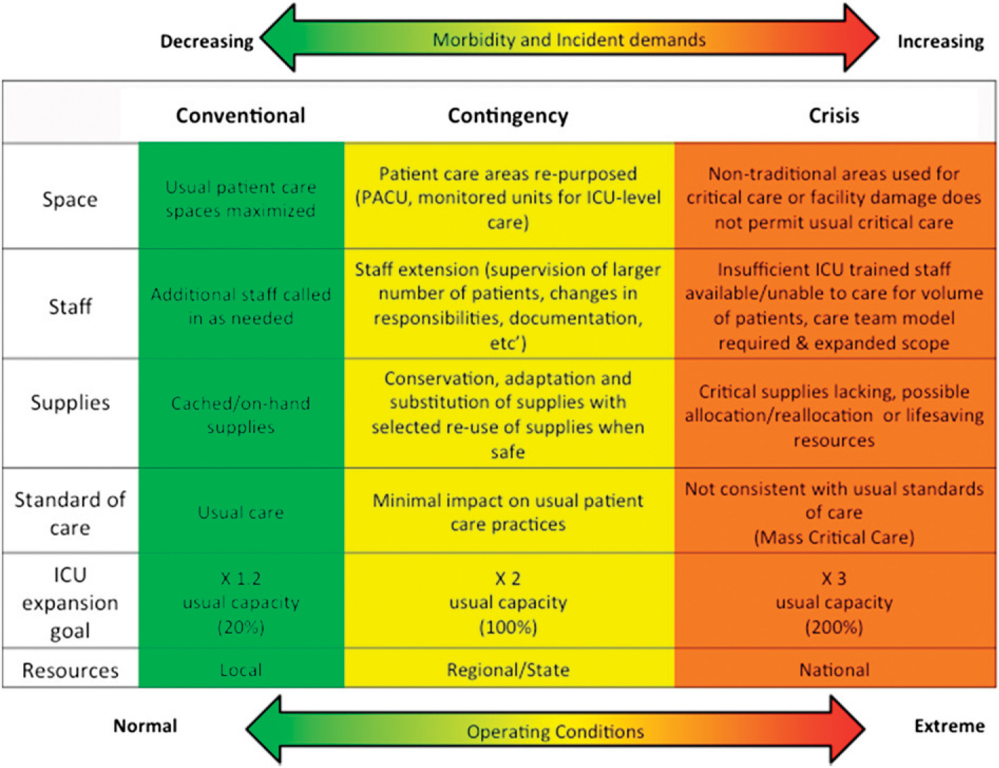

Version History
===============

+-------------+-----------------+-----------------+-----------------+
| **Version** | **Name**        | **Comments**    | **C             |
|             |                 |                 | ontributor(s)** |
+=============+=================+=================+=================+
| 0.1         | Anthem-Dig      | [DRAFT] Example | James Flynn     |
|             | italQ-V0.1.docx | work is Broker  | james.fl        |
|             |                 | Onboarding and  | ynn2@anthem.com |
|             |                 | Smart Broker    |                 |
|             |                 | Assistant       |                 |
+-------------+-----------------+-----------------+-----------------+

.. _section-1:

Contents
========

`Version History <#version-history>`__\ **2**

`Contents <#contents>`__\ **3**

`Digital Portfolio Scope <#digital-portfolio-scope>`__\ **5**

`Background <#background>`__\ **5**

   `Foundry <#foundry>`__ 5

   `10x Engineering <#x-engineering>`__ 6

   `Platform Teams <#platform-teams>`__ 6

`DigitalQ Flow <#digitalq-flow>`__\ **7**

   `Phase 1: From Proposal to
   Classification <#phase-1-from-proposal-to-classification>`__ 7

   `Why Classification is the First
   Phase <#why-classification-is-the-first-phase>`__ 7

   `Outcomes <#outcomes>`__ 7

   `Process <#process>`__ 8

   `Question A - Is the proposed solution an improvement to an existing
   solution? <#question-a---is-the-proposed-solution-an-improvement-to-an-existing-solution>`__
   8

   `Why do we ask this question? <#why-do-we-ask-this-question>`__ 8

   `Question B - Is the proposed solution
   understood? <#question-b---is-the-proposed-solution-understood>`__ 9

   `Why do we ask this question? <#why-do-we-ask-this-question-1>`__ 9

   `Question C - (If the answer to B is no) Can we reduce risk by
   dividing into
   MVPs? <#question-c---if-the-answer-to-b-is-no-can-we-reduce-risk-by-dividing-into-mvps>`__
   9

   `Why do we ask this question? <#why-do-we-ask-this-question-2>`__ 10

   `Process Diagram <#process-diagram>`__ 10

   `Phase 2: From Classification to Value
   Assessment <#phase-2-from-classification-to-value-assessment>`__ 12

   `Why Value Assessment is the Second
   Phase <#why-value-assessment-is-the-second-phase>`__ 12

   `Value Assessment for Platform-Appropriate
   Work <#value-assessment-for-platform-appropriate-work>`__ 12

   `V1: Value Comparison - Solution
   Improvement <#v1-value-comparison---solution-improvement>`__ 12

   `Step 1 - Gather Data on Existing
   Solution <#step-1---gather-data-on-existing-solution>`__ 12

   `Step 2 - Estimate Impact of Proposed
   Solution <#step-2---estimate-impact-of-proposed-solution>`__ 13

   `Step 3 - Estimate Cost to
   Implement <#step-3---estimate-cost-to-implement>`__ 13

   `Step 4 - Calculate Delivered Value and Return on Investment of
   Proposed
   Solution <#step-4---calculate-delivered-value-and-return-on-investment-of-proposed-solution>`__
   13

   `EXAMPLE Value Comparison: Broker
   Onboarding <#example-value-comparison-broker-onboarding>`__ 14

   `V2: Value Estimation - New
   Solution <#v2-value-estimation---new-solution>`__ 15

   `Step 1 - Estimate Impact of Proposed
   Solution <#step-1---estimate-impact-of-proposed-solution>`__ 15

   `Step 2 - Estimate Cost to
   Implement <#step-2---estimate-cost-to-implement>`__ 15

   `Step 3 - Calculate Delivered Value and Return on Investment of
   Proposed
   Solution <#step-3---calculate-delivered-value-and-return-on-investment-of-proposed-solution>`__
   15

   `Comparing Apples to Apples <#comparing-apples-to-apples>`__ 16

   `Value Assessment for Foundry-Appropriate
   Work <#value-assessment-for-foundry-appropriate-work>`__ 17

   `V3: Value Validation - Solution Improvement
   [PLACEHOLDER] <#v3-value-validation---solution-improvement-placeholder>`__
   17

   `V4: Value Validation - New Solution
   [PLACEHOLDER] <#v4-value-validation---new-solution-placeholder>`__ 17

`References <#references>`__\ **17**

.. _section-2:

Digital Portfolio Scope
=======================

**Functional Scope:** Classify, evaluate, prioritize, and assign
incoming work to Foundry and Platform teams such that maximum value is
delivered to Anthem stakeholders.

Where value is realized by:

-  Revenue increase

-  Cost reduction

-  Risk mitigation

-  Higher rates of software utilization

-  Employee productivity increase

-  Customer satisfaction increase

-  ...

Background
==========

Product development teams under the Anthem Digital organization are of
the following types:

-  Foundry (Discovery Teams)

-  Platform (Delivery Teams)

-  10x (Process Support Teams) - ??

Foundry
-------

The Foundry comprises cross-functional teams with expertise in
prototyping, UX, and rapid testing of software in pseudo-real-world
environments — building and deploying MVPs. Their core function is to
(in)validate hypotheses quickly. They are not expected to deliver
production grade code.

MVP - “The minimum set of features required to validate a hypothesis”

Because Foundry are conducting a *search* among novel configurations and
technologies - the long-run value delivered by the Foundry will be
directly impacted by the speed at which they can iterate. Most
hypotheses fail, so it is crucially important that they *fail fast*.

Therefore, the Foundry is structured, operationalized, and assigned work
such that the maximum time between hypotheses statements and results
from an MVP test is <**12**> weeks.

Longer projects are not appropriate for Foundry as they severely impact
the foundational value proposition.

**Foundry Objective:** Rapid Value Discovery

**Foundry Priorities:** Identification of Value, Usability, Technical
Feasibility, Business Viability

10x Engineering
---------------

[[[[[TBD - Placeholder What is 10x differentiation? How is their
operation and structure differentiated. Tech-for-tech? Dev Ops?]]]]]

Platform Teams
--------------

The Platform Teams implement production-quality work with a greater
emphasis on quality, and reliability.

**Platform Team Objective:** Consistently Provisioning Value

**Platform Priorities:** Reliability, Scalability, Performance,
Maintainability

.. _section-3:

DigitalQ Flow
=============

Phase 1: From Proposal to Classification
----------------------------------------

The first stage of the DigitalQ flow is to classify the proposed work as
appropriate for Foundry, Platform Teams, or neither.

|image0|\ Why Classification is the First Phase
~~~~~~~~~~~~~~~~~~~~~~~~~~~~~~~~~~~~~~~~~~~~~~~

We classify the work first because all following methods of value
assessment differ, based on what is knowable about the proposal. The
classification ultimately directs work into the Foundry or Platform Team
pipelines based on the feasibility of understanding likely value at this
pre-implementation stage.

Outcomes
~~~~~~~~

Proposed work is classified as..

1. S\ OLUTION IMPROVEMENT [Platform Pipeline V1]

   -  Moves into Value Comparison Process (the comparison is between the
         value delivered by the proposed solution and that of the
         current solution)

2. N\ EW SOLUTION [Platform Pipeline V2]

   -  Moves into Value Estimation Process (Estimation is the delivered
         value of proposed solution)

3. S\ OLUTION IMPROVEMENT HYPOTHESIS[Foundry Pipeline V3]

   -  Moves into Value Hypothesis Process

4. N\ EW SOLUTION HYPOTHESIS, [Foundry Pipeline V4]

   -  Moves into Value Hypothesis Process

5. POSTPONED [V5]

   -  Moves to back of DigitalQ due to technical/implementation risk
         being over threshold (unknown technology + indivisible
         hypotheses)

Process
~~~~~~~

Refer to Diagram Below

Question A - Is the proposed solution an improvement to an existing solution?
^^^^^^^^^^^^^^^^^^^^^^^^^^^^^^^^^^^^^^^^^^^^^^^^^^^^^^^^^^^^^^^^^^^^^^^^^^^^^

Is there a way, today, for a user with this need, to have that need met,
no matter how inefficient it might be currently?

|image1|

|image2|

Why do we ask this question?
^^^^^^^^^^^^^^^^^^^^^^^^^^^^

When a solution currently exists, we have a benchmark for delivered
value, and we can better estimate the value of the proposed solution
using **existing internal data** - an important step in the next phase.
When a solution does *not yet* exist, we will need to employ different
value-determination methods.

Question B - Is the proposed solution understood?
^^^^^^^^^^^^^^^^^^^^^^^^^^^^^^^^^^^^^^^^^^^^^^^^^

Can we provision the proposed solution using a set of familiar
technologies - technologies where we have a high degree of
implementation certainty.

|image3|

|image4|

.. _why-do-we-ask-this-question-1:

Why do we ask this question?
^^^^^^^^^^^^^^^^^^^^^^^^^^^^

When a technology is familiar, we know how it works, and what it can do.
This allows us to understand how it will deliver value when implemented.
This, in turn allows us to estimate business value with a much higher
degree of certainty.

When the performance of a technology is unknown, we cannot estimate the
delivered business value that will result, because that value will be
directly affected by the performance of this technology. It is
impossible to estimate business value with certainty, and it is
therefore risky to implement.

Question C - (If the answer to B is no) Can we reduce risk by dividing into MVPs?
^^^^^^^^^^^^^^^^^^^^^^^^^^^^^^^^^^^^^^^^^^^^^^^^^^^^^^^^^^^^^^^^^^^^^^^^^^^^^^^^^

Can we divide up the hypotheses and design fast self-contained
experiments such that each one is possible to resolve in an amount of
time appropriate for our business?

.. _why-do-we-ask-this-question-2:

Why do we ask this question?
^^^^^^^^^^^^^^^^^^^^^^^^^^^^

With new technologies, the overwhelming majority of hypotheses turn out
to be **invalid**. For our process of value discovery to be worthwhile -
we must understand the performance of new technologies very quickly. We
must **fail fast,** therefore the experiments must occur in a short
time, therefore they must be small.

Process Diagram 
~~~~~~~~~~~~~~~

<See next page>

.. _section-4:

|image5|
~~~~~~~~

Phase 2: From Classification to Value Assessment
------------------------------------------------

The second stage of the DigitalQ flow is to assess the business value of
the proposed work

|image6|

Why Value Assessment is the Second Phase
~~~~~~~~~~~~~~~~~~~~~~~~~~~~~~~~~~~~~~~~

Having classified proposed work in Phase 1, we now need to understand
the business value of the work proposal. Depending on the classification
of the work, this is done differently, but ultimately will provide an
apples-to-apples comparison.

For the work headed to Platform teams (knowable value) we calculate
**Delivered Value** (sometimes called Net Present Value - NPV) and
**Return on Investment** (ROI).

For the work headed to Foundry teams (less-knowable value) we calculate
**Risk-Adjusted Hypothetical Value** (If this works what will it be
worth? And what is the chance it will work?)

[We need to understand the **standalone** business impact of projects
**before** we can move into the next phase, which will factor in
resource availability, cross-project dependencies, and strategic
alignment.]

Value Assessment for Platform-Appropriate Work
~~~~~~~~~~~~~~~~~~~~~~~~~~~~~~~~~~~~~~~~~~~~~~

V1: Value Comparison - Solution Improvement
^^^^^^^^^^^^^^^^^^^^^^^^^^^^^^^^^^^^^^^^^^^

If the proposed work is classified in Phase 1 - Classification, as a
*solution improvement*, we assess the value of the project by the Value
Comparison method.

This process may vary in specific details but is generally always
applicable - if we generalize the concept of a ‘user’ as someone, or
some system, trying to get a ‘job’ done.

+----------------------------------------------+-------------+-------+
| .. rubric:: Step 1 - Gather Data on Existing | Abbr.       | Units |
|    Solution                                  |             |       |
|    :nam                                      | **N**       | units |
| e: step-1---gather-data-on-existing-solution |             |       |
|                                              | **V\ E**    | S     |
| -  Number of Users/Incidents                 |             |       |
|                                              | **OpEx\ E** | $     |
| -  Value of User Success                     |             |       |
|                                              | **P\ E**    | %     |
| -  Operating Costs (OpEx)                    |             |       |
|                                              | **V\ P**    | $     |
|    -  3rd Party Costs                        |             |       |
|                                              | **OpEx\ P** | $     |
|       -  Vendors                             |             |       |
|                                              | **P\ P**    | %     |
|       -  Licenses                            |             |       |
|                                              | **C\ P**    | $     |
|       -  ...                                 |             |       |
|                                              |             |       |
|    -  Support Costs                          |             |       |
|                                              |             |       |
|       -  Customer Support                    |             |       |
|                                              |             |       |
|       -  ...                                 |             |       |
|                                              |             |       |
|    -  Provisioning Costs                     |             |       |
|                                              |             |       |
|       -  Infrastructure Costs                |             |       |
|                                              |             |       |
|       -  ...                                 |             |       |
|                                              |             |       |
| -  Performance                               |             |       |
|                                              |             |       |
|    -  Number of Users at top of funnel       |             |       |
|                                              |             |       |
|    -  Number of successful journeys through  |             |       |
|          solution                            |             |       |
|                                              |             |       |
|    -  Attrition/failure rate                 |             |       |
|                                              |             |       |
|    -  …                                      |             |       |
|                                              |             |       |
| .. rubric:: Step 2 - Estimate Impact of      |             |       |
|    Proposed Solution                         |             |       |
|    :name: s                                  |             |       |
| tep-2---estimate-impact-of-proposed-solution |             |       |
|                                              |             |       |
| -  Value of User given proposed solution     |             |       |
|                                              |             |       |
| -  Operating Costs of proposed solution      |             |       |
|                                              |             |       |
| -  Performance of proposed solution          |             |       |
|                                              |             |       |
| .. rubric:: Step 3 - Estimate Cost to        |             |       |
|    Implement                                 |             |       |
|                                              |             |       |
|   :name: step-3---estimate-cost-to-implement |             |       |
|                                              |             |       |
| -  NRE +                                     |             |       |
|                                              |             |       |
| -  Capital Expenditure                       |             |       |
+----------------------------------------------+-------------+-------+

Step 4 - Calculate Delivered Value and Return on Investment of Proposed Solution
''''''''''''''''''''''''''''''''''''''''''''''''''''''''''''''''''''''''''''''''

First, in English:

*The amount of business value we are realizing from an operating
solution is the number of users or incidents, multiplied by the value of
those users/incidents conditional on success, multiplied by the
performance of the solution, minus the cost of providing that solution.*

Current Solution Delivered Value = **N . V\ E . P\ E - OpEx\ E**

Proposed Solution Delivered Value **= N . V\ P . P\ P - OpEx\ P**

Therefore the delivered business value of the proposed solution is the
difference between the value of the proposed solution and the value of
the current solution.

Delivered Value (DV) = Proposed Solution Delivered Value - Current
Solution Delivered Value

DV = **N . [ (V\ P . P\ P - OpEx\ P) - (V\ E . P\ E - OpEx\ E)]**

And the ROI of the proposed solution is this delivered value divided by
the implementation cost.

ROI = DV / **C\ P**

EXAMPLE Value Comparison: Broker Onboarding
'''''''''''''''''''''''''''''''''''''''''''

[[All data except Implementation Cost is placeholder - waiting on Broker
Team]]

Internal Data from Current Solution:

   **Lifetime Value** of a Broker: **V\ E** = $100,000

   Brokers **acquired** at top of Onboarding Funnel: **N** = 3000

   **Performance** of Current Solution: **P\ E** = 73% success rate

   **OpEx** of Current Solution: **OpEx\ E** = $1409*\* per broker (due
   to high frequency of support calls, 3rd party licenses etc)

Estimated Impact of Proposed Solution:

   **Lifetime Value** of a Broker (stays the same): **V\ P** = $100,000

   Brokers **acquired** at top of Onboarding Funnel (stays the same):
   **N** = 3000

   **Target Performance** of proposed Solution: **P\ E** = 91% success
   rate (increase is due to improved UX, reductions in delay, and
   automation)

   **Target OpEx** of proposed Solution: **OpEx\ P** = $217 per broker
   due to automation and removal of 3rd party dependencies

Estimated Cost to Implement:

**USD 2.9M**

Current Solution Delivered Value **=** 3000 x $100,000 x 0.73 - 3000 x
$1409

= 21M

Proposed Solution Delivered Value = 3000 x $100,000 x 0.91 - 3000 x $217

= 27M

   DV = 27M - 21M

   = **8 M**

   ROI = 8M / 2.9M

   = **275%**

So this proposal has a direct Business Value of **$8,000,000** with a
Return on Investment of **275%**

V2: Value Estimation - New Solution
^^^^^^^^^^^^^^^^^^^^^^^^^^^^^^^^^^^

If the proposed work is classified in Phase 1 - Classification, as a
*new solution*, we assess the value of the project by the Value
Estimation method.

+-----------------------------------------------+---------------------+
| .. rubric:: Step 1 - Estimate Impact of       | .. rubric::         |
|    Proposed Solution                          |    :name: section-5 |
|    :name:                                     |                     |
| step-1---estimate-impact-of-proposed-solution | **V\ P**            |
|                                               |                     |
| -  Value of User                              | **OpEx\ P**         |
|                                               |                     |
| -  Operating Costs of proposed solution       | **P\ P**            |
|                                               |                     |
| -  Performance of proposed solution           | **C\ P**            |
|                                               |                     |
| .. rubric:: Step 2 - Estimate Cost to         |                     |
|    Implement                                  |                     |
|    :name: step-2---estimate-cost-to-implement |                     |
|                                               |                     |
| -  NRE +                                      |                     |
|                                               |                     |
| -  Capital Expenditure                        |                     |
+-----------------------------------------------+---------------------+

Step 3 - Calculate Delivered Value and Return on Investment of Proposed Solution
''''''''''''''''''''''''''''''''''''''''''''''''''''''''''''''''''''''''''''''''

We use the same process as in Steps 2 and 3 above for Value Comparison.
This time we do not have data upon which to benchmark the numbers of
users, and their value.

[[[ WIP - Summarize some high-level methods to get data from existing
interactions, from market research, and modeling ]]]

Estimated Impact of Proposed Solution:

   **Lifetime Value** of a User - Estimated via market research, data,
   and modeling

   Users **acquired** at top of Funnel - Estimated via market research,
   data, and modeling

   **Target Performance** of proposed Solution: **P\ E**

   **Target OpEx** of proposed Solution: **OpEx\ P**

Estimated Cost to Implement: **C\ P**

Delivered Value (DV) = Proposed Solution Delivered Value

DV = **N . V\ P . P\ P - OpEx\ P**

And the ROI of the proposed solution is this delivered value divided by
how much it costs to implement.

ROI = DV / **C\ P**

.. _section-6:

Comparing Apples to Apples
^^^^^^^^^^^^^^^^^^^^^^^^^^

We will consider the two values for each proposal to help prioritize
work, but we’re not done yet, we have to factor in resource
availability, cross-project dependencies, and strategic alignment, which
will happen in subsequent phases.

|image7|

.. _section-7:

.. _section-8:

Value Assessment for Foundry-Appropriate Work
~~~~~~~~~~~~~~~~~~~~~~~~~~~~~~~~~~~~~~~~~~~~~

Let’s recap the type of work that makes it to this stage. This is work
where the proposed technology is **not** well understood, but the
**hypotheses can be divided** into appropriately-sized experiments.

.. _section-9:

V3: Value Validation - Solution Improvement [PLACEHOLDER]
^^^^^^^^^^^^^^^^^^^^^^^^^^^^^^^^^^^^^^^^^^^^^^^^^^^^^^^^^

The Value Validation for Solution Improvement process is the same as
Value Comparison - Solution Improvement (X1) except that the Proposed
Solution performance variable (**P\ E**) is unknown. Recall:

Delivered Value (DV) = Proposed Solution Delivered Value - Current
Solution Delivered Value

DV = **N . [ (V\ P . P\ P - OpEx\ P) - (V\ E . P\ E - OpEx\ E)]**

And this time we are unsure of **P\ E**

But we can build a model of the delivered value of a project by trying
different values for **P\ E** in our delivered value equation and
estimating the likelihood of achieving that performance.

Step 1 -

V4: Value Validation - New Solution [PLACEHOLDER]
^^^^^^^^^^^^^^^^^^^^^^^^^^^^^^^^^^^^^^^^^^^^^^^^^

The Value Validation for New Solution process is the same as V2 except

References
==========

“NPV and Capital Budgeting” - Timothy Luehrman - Harvard Business School
Core Curriculum
[`link <https://hbsp.harvard.edu/product/5176-PDF-ENG?itemFindingMethod=Collections>`__]

**<<<<<<SCRATCH>>>>>>>**

1. Value Estimation [Platform Teams]

By estimating the absolute value of the proposed solution, we can
determine the expected business value of the completed project, and the
return on capital invested.

2. Value Hypothesis [Foundry]

(causal modeling etc)

By asking ‘What would this be worth, if it works?’, and ‘What are the
chances it will work?’ we can determine the statistical expected value
of a project, and work on projects in order from highest to lowest
expected value.

.. |image1| image:: media/image6.png
   :width: 4.91667in
   :height: 2.77083in
.. |image2| image:: media/image5.png
   :width: 4.91667in
   :height: 2.30556in
.. |image3| image:: media/image3.png
   :width: 4.91667in
   :height: 2.01389in
.. |image4| image:: media/image4.png
   :width: 4.94792in
   :height: 1.90278in
.. |image5| image:: media/image1.png
   :width: 9.0193in
   :height: 5.45833in

.. |image7| image:: media/image2.png
   :width: 4.13021in
   :height: 3.63889in
