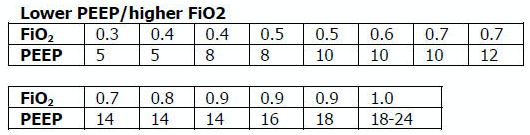
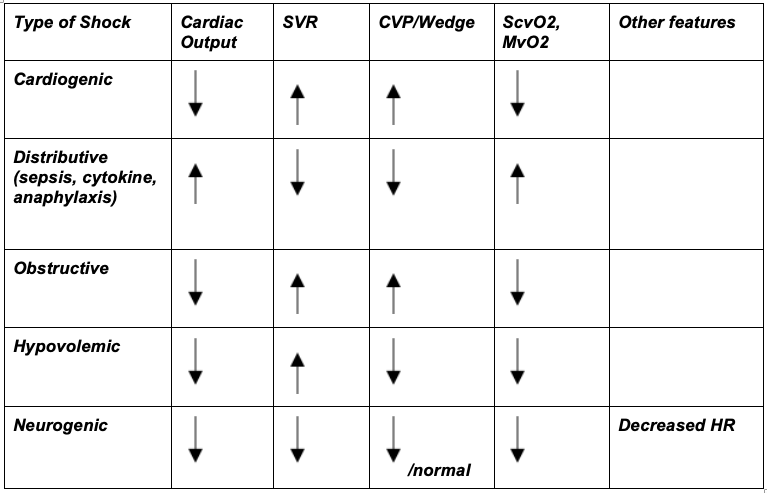

 image:: images/bwh_logo.png
  :width: 800
  :alt: Brigham Women's Hospital Logo

**Brigham and Women’s Hospital**

**COVID-19 Critical Care Clinical Guidelines**

Updated: 3/19/2020

**This document is a work in progress. We have much to learn.**

**This is updated daily with evolving information; do not print.**

**Please send suggestions:** BWHCOVIDGuidelines@gmail.com

**Disclaimer:** This document is intended as a resource for clinicians
caring for critically-ill COVID-19 patients, based on available evidence
and recommendations of governing bodies. The recommendations do not
replace clinical judgment or the need for individualized patient care
plans. While we attempt to keep this document up-to-date, the literature
on COVID-19 is rapidly evolving, and we suggest that practitioners
search for the most up-to-date literature on any specific topic. These
guidelines will also rapidly evolve as they are implemented into
clinical practice and we receive feedback from practitioners. Finally,
these guidelines were developed based on practice patterns and
infrastructure at Brigham and Women’s Hospital in Boston, MA; local
factors should be taken into account if utilized at other hospitals.

COVID-19 one page Quick Guides:
===============================

`COVID-19 Initial work-up QUICK
GUIDE <https://www.dropbox.com/s/th0vxif5x3hoejs/INITIAL%20WORKUP-%20covid%20quick%20guide.pdf?dl=0>`__

`COVID-19 ARDS management QUICK
GUIDE <https://www.dropbox.com/s/1na1vj0kq7dt0ys/RESP%20FAILURE-%20covid%20quick%20guide.pdf?dl=0>`__

`COVID-19 ICU care QUICK
GUIDE <https://www.dropbox.com/s/9ff4h4a8wea35oq/ICU%20CARE-%20covid%20quick%20guide.pdf?dl=0>`__

**Table of Contents**

`COVID-19 one page Quick
Guides: <#covid-19-one-page-quick-guides>`__\ **\ 1**

`Chapter 1: Non-ICU Management, Triage,
Transfers <#chapter-1-non-icu-management-triage-transfers>`__\ **\ 3**

   `Clinical Course of COVID-19 <#clinical-course-of-covid-19>`__\ 3

   `Non-ICU Management Principles <#non-icu-management-principles>`__\ 4

   `Triage to ICU <#triage-to-icu>`__\ 6

   `Transfer Process <#transfer-process>`__\ 6

`Chapter 2: Respiratory Support for COVID-19
Patients <#chapter-2-respiratory-support-for-covid-19-patients>`__\ **\ 7**

   `Respiratory Failure and ARDS <#respiratory-failure-and-ards>`__\ 7

   `Management of Hypoxemia <#management-of-hypoxemia>`__\ 7

   `Initial Mechanical
   Ventilation <#initial-mechanical-ventilation>`__\ 9

   `PEEP and Mechanics <#peep-and-mechanics>`__\ 10

   `Targeting Sedation for Ventilator
   Synchrony <#targeting-sedation-for-ventilator-synchrony>`__\ 11

   `General Management of Ventilated ARDS
   Patients <#general-management-of-ventilated-ards-patients>`__\ 12

   `Managing Ventilation <#managing-ventilation>`__\ 13

   `Managing Oxygenation <#managing-oxygenation>`__\ 13

   `Proning and Pulmonary
   Vasodilators <#proning-and-pulmonary-vasodilators>`__\ 15

   `ECMO consultation <#ecmo-consultation>`__\ 16

`Chapter 3: COVID-19 Therapies and Clinical
Trials <#chapter-3-covid-19-therapies-and-clinical-trials>`__\ **\ 17**

   *Note: The anti-viral and anti-inflammatory section below written by
   our critical care group is meant to provide a summary of the
   literature. This section does not represent the views or
   recommendations of the BWH Div. of Infectious Disease.*

   `Clinical trials <#clinical-trials>`__\ 17

   `Antibiotic stewardship <#antibiotic-stewardship>`__\ 17

   `Metered-dose inhalers (MDIs) vs.
   nebulizers <#metered-dose-inhalers-mdis-vs.-nebulizers>`__\ 18

   `Airway Clearance <#airway-clearance>`__\ 18

   `Inhaled Pulmonary
   Vasodilators <#inhaled-pulmonary-vasodilators>`__\ 19

   `Systemic Corticosteroids <#systemic-corticosteroids>`__\ 20

   `Anti-IL6 Agents (Tocilizumab,
   Siltuximab) <#anti-il6-agents-tocilizumab-siltuximab>`__\ 20

   `Hydroxychloroquine and
   Chloroquine <#hydroxychloroquine-and-chloroquine>`__\ 21

   `Angiotensin Converting Enzyme Inhibitors (ACE-I) and Angiotensin II
   Receptor Blockers
   (ARB) <#angiotensin-converting-enzyme-inhibitors-ace-i-and-angiotensin-ii-receptor-blockers-arb>`__\ 23

   `Non-steroidal anti-inflammatory drugs
   (NSAIDs) <#non-steroidal-anti-inflammatory-drugs-nsaids>`__\ 23

   `Blood Products <#blood-products>`__\ 24

`Chapter 4: Cardiac Complications of
COVID-19 <#chapter-4-cardiac-complications-of-covid-19>`__\ **\ 25**

   `Acute Cardiac Injury <#acute-cardiac-injury>`__\ 25

   `Cardiovascular Testing <#cardiovascular-testing>`__\ 25

   `Arrhythmias <#arrhythmias>`__\ 26

   `Acute Coronary Syndromes <#acute-coronary-syndromes>`__\ 27

   `Pericarditis and Myocarditis <#pericarditis-and-myocarditis>`__\ 28

`Chapter 5: Shock: Septic, Cardiogenic, and Cytokine
Storm <#chapter-5-shock-septic-cardiogenic-and-cytokine-storm>`__\ **\ 28**

   `Undifferentiated Shock in
   COVID <#undifferentiated-shock-in-covid>`__\ 28

   `Differentiating Shock <#differentiating-shock>`__\ 30

   `Septic Shock and Secondary
   Infections <#septic-shock-and-secondary-infections>`__\ 31

   `Cardiogenic Shock <#cardiogenic-shock>`__\ 32

   `Cytokine Activation Syndrome <#cytokine-activation-syndrome>`__\ 34

`Chapter 6: Thrombotic and Coagulation
Manifestations <#chapter-6-thrombotic-and-coagulation-manifestations>`__\ **\ 35**

   `Thrombotic Disease <#thrombotic-disease>`__\ 35

   `Disseminated Intravascular Coagulation
   (DIC) <#disseminated-intravascular-coagulation-dic>`__\ 36

`Chapter 7: Renal
Manifestations <#chapter-7-renal-manifestations>`__\ **\ 37**

   `Acute Kidney Injury <#acute-kidney-injury>`__\ 37

`Chapter 8: Other Guidance <#chapter-8-other-guidance>`__\ **\ 38**

   `Liver Disease <#liver-disease>`__\ 38

   `Considerations for Oncology
   Patients <#considerations-for-oncology-patients>`__\ 39

   `Goals of Care <#goals-of-care>`__\ 42

   `Management of Cardiac Arrest <#management-of-cardiac-arrest>`__\ 42

   `Ethical Considerations and Resource
   Allocation <#the-role-of-palliative-care>`__\ 43

**AFTERWORD**

`REFERENCES <#_iw1b3dijf01r>`__\ **\ 45**

`ADDENDUM: COVID ICU Bundle Checklist <#section-1>`__\ **\ 49**

Chapter 1: Non-ICU Management, Triage, Transfers
================================================

1. .. rubric:: Clinical Course of COVID-19
      :name: clinical-course-of-covid-19

   a. **Clinical presentation:** non-specific, flu-like illness

      i.   Fever (44-98%)

      ii.  Cough (46-82%)

      iii. SOB (20-64%)

      iv.  URI (5-25%)

      v.   GI sx (10%; usually before respiratory sx)

   b. **Transmission:**

      i.   Large droplets and fomites

      ii.  Incubation period: typi cally 2-7d, up to 14d

      iii. Symptomatic and asymptomatic patients can transmit the virus

   c. **Course for admitted patients**:

      i.   ~ 80% don’t require critical care

      ii.  ~ 10-20% develop bacterial superinfection

      iii. ~ 30% develop ARDS

      iv.  ~ 5% develop renal injury requiring renal replacement therapy

      v.   Transaminemia is common; fulminant hepatitis not yet reported

      vi.  Reports of cardiomyopathy in critically ill patients; some
              progress to cardiogenic shock late in course

      vii. The data on rates of viral co-infection is incomplete.

   d. **Reasons for ICU admission:**

      i.   Hypoxemic respiratory failure is the most common indication
              for ICU.

           1. Reports of rapid progression to intubation within 12-24h

      ii.  Few patients present with shock, can develop late in course

      iii. Median time from symptom onset to ICU transfer is ~10 days

   e. **Poor prognostic indicators:**

      i.   Demographics: Age > 65, male

      ii.  Comorbidities: cardiovascular disease (including HTN),
              pulmonary disease, diabetes, malignancy, immunosuppression

      iii. Lab findings: severe lymphopenia, elevated TnT, elevated Cr,
              elevated LDH, elevated CRP, elevated D-dimer

   f. **Cause of death:**

      i.  Cause of death in retrospective study from Wuhan of 68
             patients who died of COVID (Ruan et al, *Intensive Care
             Med*, 2020):

          1. 53% (n=36) respiratory failure

          2. 7% (n=5) myocardial damage/ heart failure

          3. 33% (n=22) concomitant respiratory & heart failure

          4. 7% (n=5) unknown causes

      ii. Mortality rate appears to correlate closely with age and
             availability of medical resources

2. .. rubric:: Non-ICU Management Principles
      :name: non-icu-management-principles

   a. **Diagnostic studies:**

      i.   Labs

           1. On admission: CBC with differential, BMP, LFTs, LDH, CRP,
                 D-dimer, Troponin / CPK, PTT / INR, Procalcitonin

           2. Daily: CBC with differential, BMP

              a. For stable floor patients, consider every other day

           3. Every other day: LFTs, LDH, CRP, D-dimer, Troponin / CPK
                 (if in ICU), Triglycerides (if on propofol)

           4. If clinical worsening: LFTs, LDH, CRP, D-dimer, Troponin,
                 CPK, PTT / INR, Procalcitonin, Ferritin, Fibrinogen

           5. Expert opinion does not recommend routine pro-BNP.

      ii.  Chest imaging: Portable CXR is sufficient in most cases, and
              the utility of daily CXR should be evaluated on a
              case-by-case basis.

           1. Chest imaging variable; bilateral patchy opacities most
                 common

           2. Chest CT often will not change treatment and should only
                 be obtained only if necessary due to risks and time
                 associated with transport and decontamination of
                 equipment.

           3. Point of Care Ultrasound (POCUS) of the lungs can be used
                 in lieu of Chest Xray by experienced providers

      iii. Baseline EKG

      iv.  Obtain additional studies only if necessary

           1. No routine TTEs (for cardiac studies, see “Cardiac
                 Complications of COVID” chapter).

   b. **Medical management:**

      i.   Management is supportive

      ii.  Fluid management should be conservative due to risk of
              hypoxia/CHF

           1. Do not use maintenance fluids

      iii. Antiviral and immune-modulating therapies are investigational
              (see “COVID Therapies and Clinical Trials”)

   c. **Early Advance Care Planning:**

      i.  In conscious patients, review or sign Health Care Proxy form

      ii. Discuss and document goals of care on admission

          1. Educate patient and family on disease course

          2. Focus on desired quality of life and tolerance for ICU
                measures

             a. Avoid implying availability of ICU measures if unknown
                   (refer to local ethics guidance)

   d. **Avoid increasing risk of transmission:** Generally avoid
         transport if possible.

      i. Non-Invasive Positive Pressure Ventilation (NIPPV: BiPAP,
            CPAP), High Flow Nasal Cannula (HFNC), Humidified Venturi
            Face Masks, Nebulizers increase aerosolization.

         1. Any aerosol-generating intervention must be performed under
               Strict (Airborne) Isolation Precautions

         2. In current policy, patients with severe OSA may continue
               nocturnal CPAP / BiPAP but must use a BWH NIPPV mask and
               machine, not their home mask or nasal pillows which have
               elevated aerosol risk. BWH machines have dual limb (with
               HEPA filter); in contrast, home machine have a single
               limb so have an anti-asphyxiation (pop-off) valve that
               increases aerosol risk.

         3. Use metered dose inhalers instead of nebulizers.

         4. If patient already on BiPAP / CPAP / HFNC becomes
               COVID-suspected, transition to non-rebreather followed by
               intubation.

         5. NIPPV\* is not used for ARDS; early intubation is preferred.

..

   \*Can be considered on case-by-case basis for highly reversible
   indications (*e.g.*, flash pulmonary edema with rapid resolution).

6. Similar to many U.S. medical centers, our current default is to avoid
      HFNC in DNI patients and to use NRB, although exceptions can be
      considered on a case-by-case basis.

3. .. rubric:: Triage to ICU
      :name: triage-to-icu

   a. **Consult the ICU triage team EARLY for:**

      i.   Provider concern

      ii.  Respiratory distress

           1. Need O2 > 6 LPM to maintain SpO2 > 92 or PaO2 > 65.

           2. Rapid escalation of oxygen requirement.

           3. Significant work of breathing.

      iii. Hemodynamic instability after initial conservative fluid
              resuscitation

           1. SBP < 90, Mean arterial pressure < 65, or Heart rate >
                 120.

      iv.  Acidosis

           1. ABG with pH < 7.3 or PCO2 > 50 or above patient’s
                 baseline.

           2. Lactate > 2.

      v.   Need for intensive nursing care or frequent laboratory draws
              requiring arterial line.

      vi.  Severe comorbid illness / high risk for deterioration.

4. .. rubric:: Transfer Process
      :name: transfer-process

   a. **Additional details in Strict Isolation Procedures Manual.**

   b. **Floor / ED to ICU:**

      i.   ICU RN brings ICU bed to the floor for transfer (to avoid bed
              transfer in COVID precautions room and subsequent bed
              cleaning).

      ii.  Patient wears surgical mask, with an extra clean gown and
              sheet on top.

      iii. Providers wear standard PPE during transport.

      iv.  Security facilitates the shortest and fastest transfer route,
              walks 6 ft away from patient and providers, not required
              to wear PPE

      v.   Necessary tests (*e.g.* CT), should be obtained during
              transfer if possible.

   c. **ICU to floor:**

      i.   RN wears standard PPE

      ii.  Patient travels in wheelchair or stretcher

      iii. Security facilitates the shortest and fastest transfer route,
              walks 6 ft away from patient and providers, not required
              to wear PPE

   d. **Floor to discharge: see separate documentation of discharge
         criteria/ planning**

      i.   RN wears standard PPE

      ii.  Patient travels in wheelchair

      iii. Security facilitates the shortest and fastest transfer route,
              walks 6 ft away from patient and providers, not required
              to wear PPE

      iv.  Patient is escorted directly into vehicle; contact care
              management if patient does not have access to a personal
              vehicle

Chapter 2: Respiratory Support for COVID-19 Patients
====================================================

1. .. rubric:: Respiratory Failure and ARDS
      :name: respiratory-failure-and-ards

   a. **Pathophysiology:**

      i.  Histology shows bilateral diffuse alveolar damage with
             cellular fibromyxoid exudates, desquamation of pneumocytes,
             pulmonary edema, and hyaline membrane formation (Xu et al.,
             *Lancet Respir Med*, 2020)

      ii. Some evidence of direct viral injury to lung tissue, rather
             than purely hyperinflammatory process (Xu et al., *Lancet
             Respir Med,* 2020)

   b. **Time course:**

      i.  Anecdotal reports that progression of hypoxemic respiratory
             failure occurs rapidly (within ~12-24 hours)

      ii. From onset of symptoms, median time to:

          1. Development of ARDS: 8-12 days (Wang et al., *JAMA*, 2020;
                Zhou et al., *Lancet*, 2020; Huang et al., *Lancet*,
                2020)

          2. Mechanical ventilation: 10.5-14.5 days (Huang et al.,
                *Lancet*, 2020; Zhou et al., *Lancet*, 2020)

2. .. rubric:: Management of Hypoxemia
      :name: management-of-hypoxemia

   a. **Supplemental Oxygen:**

      i. Humidified nasal cannula (NC) 1 to 6 LPM for target SpO2 92-96%

   b. **Escalation:**

      i.  If a patient requires > 6 LPM NC, initiate dry Venturi mask
             (non-humidified to reduce aerosolization risk)

          1. Start Venturi mask at 9 LPM and FiO2 28%

          2. Up-titrate FiO2 to goal SpO2 of 92-96% (not exceeding FiO2
                35%)

          3. If FiO2 > 35% then increase flow to 12 LPM

      ii. Notify ICU triage pager

   c. **Avoid high-flow nasal cannula (HFNC) and non-invasive positive
         pressure ventilation (NIPPV; i.e. CPAP/BiPAP) for ARDS.**

      i.   Patients on nocturnal NIPPV at home should continue their
              nocturnal NIPPV. However, patient must use BWH NIPPV mask
              and machine (not home mask/nasal pillow or machine due to
              increased aerosol risk with home pillows/mask/machine)
              under strict airborne precautions.

      ii.  If a patient already on HFNC or NIPPV becomes a COVID-19 PUI,
              transition to non-rebreather if safe

           1. Ideally, the patient should be off an aerosol generating
                 device like HFNC or NIPPV for 45 minutes prior to
                 intubation, but it is definitely not a requirement.

      iii. If a patient is DNR/DNI or otherwise is not eligible for
              intubation:

           1. **Current policy is to default to avoiding HFNC or NIPPV
                 in DNI / DNR patients. However, neither HFNC nor NIPPV
                 is prohibited and case-by-case exceptions could
                 apply.**

           2. This is an evolving area without definitive evidence or
                 uniform policy that underwent multi-disciplinary
                 discussion.

           3. Considerations include:

-  Safety of staff (particularly Resp. Therapy and nursing);

-  Paucity of data on the increased aerosol risk;

-  WHO interim guidelines (published 2020 Mar 13) on COVID-19 are more
      liberal about the usage of HFNC and NIPPV, stating that systems
      with “good interface fitting [i.e., good seal, no air leak] do not
      create widespread dispersion of exhaled air and therefore should
      be associated with low risk of airborne transmission.”

-  Difficulty in assessing how many patients that fail Non-Rebreathing
      mask would survive if given HFNC.

-  Pro-active treatment of air hunger through other means.

-  HFNC has been utilized in lieu of ventilation of both full code and
      DNI / DNR patients in the setting of limited resources.

..

   *If HFNC or NIPPV used*

a. For HFNC, have patient wear a surgical mask if possible. and try to
      limit flow rate to < 30 L/min

b. For BiPAP, use an in-line viral filter.

c. Ensure masks/devices fit well and there is no air leak, as leaks
      propel potentially infected air significant distances (see below)

i. *Rationale*: General consensus suggests that HFNC and NIPPV increase
      the risk of viral transmission. Given the rapid progression of
      disease, we do not expect many patients can be salvaged/avoid
      intubation using HFNC/NIPPV, but this is unknown

   1. A systematic review on SARS found that NIPPV was associated with
         increased risk of viral transmission to healthcare workers (n=2
         studies), but HFNC was not (n=1) (Tran et al., *PLoS One*,
         2012)

   2. Other studies with very limited power exist, such as a post-hoc
         analysis that found no secondary infections in medical staff
         from patients with influenza H1N1 treated with HFNC but was
         limited to only n=20 (Rello *et al.*, *J Crit Care.* 2012);

   3. Exhaled air distances are minimally increased with CPAP pressures
         up to 20 cm H2O and HFNC up to 60 LPM; device/interface leaks
         cause significant lateral air travel (Hui et al., *Eur Respir
         Ji,* 2019)

a. **Early intubation:**

   i.   If FiO2 requirements are rising rapidly, we recommend early
           consultation with anesthesia for possible intubation

        1. Case reports from China suggest high failure rates for
              non-invasive ventilation, including high-flow nasal oxygen
              (Zuo et al., *Chin Med Sci J*, 2020)

   ii.  Once FiO2=60% and SpO2 < 92%, call for intubation if patient is
           a candidate for mechanical ventilation

        1. There is a COVID Airway Code Team with specific protocols for
              avoiding aerosolization.

        2. Many centers suggest Rapid Sequence Intubation when fully
              paralyzed, without ambu-bag (which generates aerosols) and
              highly experienced operators (*e.g.*, anesthesia
              attending).

   iii. Other indications for intubation (tachypnea, work of breathing)
           apply

3. .. rubric:: Initial Mechanical Ventilation
      :name: initial-mechanical-ventilation

   a. **Intubations outside of ICU:**

      i.  Should be attended by the Resource RT, who can facilitate
             early and appropriate ventilator settings with
             non-intensivists

      ii. Use “Mechanical Ventilation with Sedation” orderset

   b. **Initiate Volume Control (AC/VC) mode**

   c. **Initial tidal volume (Vt):**

      i. Vt = 6 ml/kg (based on ideal body weight [IBW] from ARDSnet
            table -see table)

         1. IBW men (kg)= 50 + 2.3 (height in inches – 60)

         2. IBW women (kg)= 45.5 + 2.3 (height in inches – 60)

..

   |image1|

d. **Initial respiratory rate 16-24, higher if acidosis present**

e. **Initial PEEP based on BMI:**

   i.   BMI < 35: PEEP 10

   ii.  BMI 35 to 50: PEEP 12

   iii. BMI > 50: PEEP 15

f. **Initial FiO2:**

   i. 100% immediately post-intubation, then rapidly wean to SpO2 92-96%
         (Barrot et al., *N Engl J Med*, 2020)

g. **Obtain STAT portable CXR to confirm endotracheal tube location:**

   i.  Order and page radiology at time of intubation

   ii. Prioritize CXR and vent titration over procedures (such as
          central venous catheter placement) if possible.

h. **Within 30 minutes of intubation, obtain an ABG (preferred) or a VBG
      and adjust ventilation and oxygenation as needed**

4. .. rubric:: PEEP and Mechanics
      :name: peep-and-mechanics

   a. **If patients supported by Hamilton G5 Ventilator (most common),
         perform the following within 10 minutes of intubation:**

      i. Determine best PEEP following intubation while paralyzed using
            Pressure-Volume (PV) tool

         1. This is a departure from use of Best PEEP Trials. PV tool is
               the preferred method due to widespread familiarity with
               RT staff, institutional experience, and minimizing
               provider exposure

   b. **If patients not supported by Hamilton G5 Ventilator, perform the
         following within 10 minutes of intubation**:

      i. Initiate PEEP at BMI settings above and titrate PEEP according
            to ARDSnet Lower PEEP table. Currently, after discussion,
            both MGH and BWH recommend the lower PEEP table as a back-up
            if PEEP cannot be individualized (*e.g.*, experienced
            respiratory therapists or intensivists unavailable). The
            lower (rather than higher) PEEP table was selected primarily
            to avoid doing initial harm patients with poor lung
            compliance.

..

   |image2|

c. **After best PEEP determined, obtain** **respiratory mechanics**:

   i.  Plateau pressure (with goal < 30, management below)

   ii. Static compliance

d. **Obtain arterial blood gas:**

   i.  Goal pH 7.25 to 7.45

   ii. Calculate P/F ratio from initial post-intubation ABG

e. **Routine esophageal balloon use is not recommended**

5. .. rubric:: Targeting Sedation for Ventilator Synchrony
      :name: targeting-sedation-for-ventilator-synchrony

   a. **Initially target RASS -2 to -3 (see table):**

      i. Maintain deep sedation immediately post-intubation while
            paralyzed (assume 60 minutes for Rocuronium, 10 minutes for
            succinylcholine)

         1. Preferred initial sedation regimen:

            a. Fentanyl/Hydromorphone (boluses +/- infusion) + Propofol:
                  target analgosedation and optimize analgesia first
                  while decreasing sedative requirements

            b. Measure triglycerides every third day on propofol or
                  earlier if other reasons for hypertriglyceridemia

         2. Adjunct agent: Midazolam

         3. Use dexmedetomidine only when nearing extubation

   b. **Target ventilator synchrony:** Ventilator-induced lung injury
         (VALI) is common in patients who are not synchronous with the
         ventilator and can cause significant lasting damage

      i. Once at target RASS after paralytics have worn off, assess
            patient synchrony with the ventilator (e.g. signs of
            breath-stacking, double triggering, other ventilator alarms)

         1. Titrate sedatives/analgesics to ventilator synchrony
               allowing for deeper RASS

         2. If patient remains dyssynchronous despite deep sedation
               (RASS -5), initiate continuous paralytics (ensure BIS 40
               to 60 prior to initiating and during paralysis)

..

   |image3|

6.  .. rubric:: General Management of Ventilated ARDS Patients
       :name: general-management-of-ventilated-ards-patients

    a. **Consider whether patient requires daily CXR:**

       i. CXR clearly indicated for:

          1. Clinical change

          2. Concern for displaced ET tube:

             a. Sudden increase in peak inspiratory pressure or
                   resistance

             b. Decreased, unilateral breath sounds (usually on the
                   right)

             c. RN or RT concern for change in depth of ET tube at teeth

    b. **COVID-19 ICU Bundle:**

       i. Ventilated patients should all have a daily ICU “Bundle” of
             best practices. See Addendum 1 for a proposed “COVID-19 ICU
             Bundle”

    c. **Ventilator consults:**

       i. If you need additional assistance managing ventilator choices,
             you can request a pulmonary phone/in-person consult (pager
             11957)

7.  .. rubric:: Managing Ventilation
       :name: managing-ventilation

    a. **Follow ARDSnet ventilation where possible:**

       i. Tidal volumes should be 4-6 cc/kg using IBW (see table above)
             to minimize volumes (and thus ventilator injury)

    b. **Minute ventilation (respiratory rate x tidal volume) typically
          drives pH and PC02:**

       i.   Titrate ventilatory parameters to pH, not PCO2

       ii.  To achieve low tidal volumes, we tolerate hypercapnia
               (functionally no limitation unless clinical sequelae) and
               acidemia (pH > 7.2)

       iii. Because tidal volumes are low, the respiratory rate often
               has to be high to accommodate; typical RR is 20-35
               breaths/minute

    c. **pH goal is normally 7.25-7.45:**

       i.   If pH > 7.45, decrease respiratory rate

       ii.  If pH 7.15-7.30, then increase respiratory rate until pH >
               7.30, or PaCO2 < 25 (maximum RR= 35 breaths/minute)

       iii. If pH < 7.15, then increase respiratory rate to 35
               breaths/minute

       iv.  If pH still < 7.15, then perform the following:

            1. Tidal volume may be increased by 1 mL/kg until pH > 7.15
                  (until plateau pressure reaches 30 cm H2O or tidal
                  volume reaches 8 cc/kg)

            2. Deep sedation advancing to RASS -5 if needed

            3. If no improvement, initiate continuous paralysis

            4. If still no improvement, initiate prone ventilation (may
                  improve V/Q matching and better ventilation)

8.  .. rubric:: Managing Oxygenation
       :name: managing-oxygenation

    a. **Minimizing oxygen toxicity:**

       i.   PEEP and Fi02 drive oxygenation

       ii.  The goal is to deliver a partial pressure of oxygen to
               perfuse tissues (PaO2 > 75, Sp02 >92%) while limiting
               lung injury from high distending pressures (Ppl < 30) and
               hyperoxia (FiO2 < 95, SpO2 < 96%).

       iii. Lower limit goals for PaO2 / SpO2 are widely debated (and
               discuss in *Rationale*); PaO2 > 65 and SpO2 >89% is also
               commonly used at BWH.

    b. **PEEP management:**

       i.  Initial PEEP should be set as explained in section 4 above.

       ii. If patient is hypoxic on Vt = 6 ml/kg and ideal PEEP from PV
              tool (or PEEP determination from ARDSnet table for
              non-Hamilton G5 ventilators), perform the following:

           1. Deep sedation, advancing to RASS -5 if needed; if no
                 improvement then:

           2. Initiate continuous paralysis (cisatracurium bolus
                 0.2mg/kg followed by infusion at 0-5 mcg/kg/min
                 titrated to patient-ventilator synchrony); if no
                 improvement then:

           3. Initiate prone ventilation (see below); high consideration
                 for use early in severe ARDS (<36 hours from ARDS
                 onset, start discussion of proning when P:F < 150,
                 prone within 12 hours of FiO2 > 75%)

    c. **Checking plateau pressure:**

       i. Check plateau pressure with every change in tidal volume,
             PEEP, or clinical deterioration (worsening oxygenation) but
             not as part of routine practice

          1. If plateau pressure is > 30 cm H20, then decrease tidal
                volume by 1 ml/kg (minimum 4 mL/kg)

          2. If plateau pressure is < 25 H20 and tidal volume < 6 mL/kg,
                then increase tidal volume by 1 mL/kg until plateau
                pressure is > 25 cm H2O or tidal volume = 6 mL/kg

          3. If plateau pressure is < 30 cm H20 and patient is breath
                stacking or dys-synchronous, then increase tidal volume
                in mL/kg increments to 7 mL/kg or 8 mL/kg so long as
                plateau pressure is < 30 cm H20

    d. **Adjusting Fi02:**

       i.   Adjust Fi02 after optimizing PEEP

       ii.  Goal FiO2 < 75%; if FiO2 > 75%; patient requires ventilator
               optimization. If you need assistance, pulmonary
               consultation is available (pager 11957)

       iii. It is reasonable to put a desaturating patient temporarily
               on 100% Fi02, but remember to wean oxygen as rapidly as
               possible

    e. **Rationale**:

       i.  *Avoiding hyperoxia:* Extensive mammalian animal data
              demonstrates that hyperoxic injury occurs at an FiO2 ≥ 75%
              (at sea level) with the rate of injury increasing as FiO2
              exceeds that threshold. In multiple mammalian models, an
              FiO2 of 100% for 48 to 72 hours is associated with nearly
              100% mortality rate. In lung injury models, the time to
              death is markedly attenuated. In an effort to reduce the
              potential for hyperoxic injury, the threshold of FiO2 ≥
              75% triggers progressive intervention throughout this
              protocol: increased sedation, paralysis, proning and ECMO
              consultation. For a review of hyperoxic acute lung injury,
              see Kallet and Matthay, *Respir Care*, 2013.

       ii. *Setting the lower oxygen limits:* There is debate on the
              proper PaO2 goal, and our rationale relies on evidence for
              lack of benefit from conservative PaO2 goals in clinical
              trials (*i.e.*, PaO2 > 55) and past association between
              lower PaO2 and cognitive impairment, although the evidence
              is certainly not definitive (mean PaO2 71 [IQR 67-80] for
              cognitively impaired survivors versus mean PaO2 86 [IQR,
              70-98] in non-impaired survivors of ARDS (Mikkelsen *et
              al*., *Am J Respir Crit Care Med*. 2012). In the
              LOCO\ :sub:`2` multi-center, randomized clinical trial,
              patients with ARDS were randomized to their PaO2 55-70,
              SpO2 88-92%; or PaO2 90-105, SpO2 >95%); the trial was
              stopped after enrollment of 205 patients due to futility
              and safety concerns (44% mortality in conservative oxygen
              group versus 30%; (Barrot *et al.*, *New Eng J Med*,
              2020).

9.  .. rubric:: Proning and Pulmonary Vasodilators
       :name: proning-and-pulmonary-vasodilators

    a. **Prone early:**

       i. We recommend early proning in severe ARDS without vasodilator
             trial (a depature from our typical practice for ARDS not
             due to COVID-19): <36 hours from ARDS onset, start
             discussion of prone when P:F < 150, prone within 12 hours
             of FiO2 > 75% (Guérin, *N Engl J Med*, 2013).

    b. **Eligibility criteria for proning:**

       i. Eligibility may vary depending on resources and staffing.
             Currently we recommend:

          1. Age < 75

          2. No high grade shock (either single agent norepinephrine 20
                mcg/min or norepinephrine < 15 mcg/min and vasopressin)

          3. Not on CRRT or at risk of impending renal failure (due to
                difficulties in maintaining dialysis access while
                proned)

          4. The only absolute contraindications to proned ventilation
                are spinal cord injury and open chest; BMI and patient
                size are not contraindications

    c. **To initiate prone ventilation outside of MICU and 11C:**

       i.  Discuss with the PCCM Consultation team assigned to that unit

       ii. ICU charge nurse to contact MICU charge nurse for nursing
              assistance

    d. **Managing a proned patient:**

       i.   Proning protocol is available at the MICU sharepoint

       ii.  Maintain deep sedation with target RASS -4 to -5 while
               proned

       iii. 1 hour post-initiation of prone ventilation:

            1. Adjust oxygen parameters: re-assess lung mechanics
                  (plateau pressure and P-V tool to determine optimal
                  PEEP) and adjust PEEP and titrate FiO2 as in “Managing
                  Ventilation” (section 7)

            2. Assess tidal volume and adjust ventilation parameters as
                  in section 6

               a. If Vt < 6 ml/kg, may increase to maximum limit of 8
                     ml/kg while Ppl < 30

       iv.  If patient demonstrates improvement on proning then
               recommend:

            1. Discontinuing of continuous neuromuscular blockade and
                  re-assess ventilator dyssynchrony; re-institute if
                  dyssynchronous

            2. Return to supine ventilation when following criteria are
                  met:

               a. Ppl < 25

               b. FiO2 < 50

               c. pH > 7.3

               d. P:F > 200

       v.   Repositioning and skin care while proned:

            1. Currently we recommend continuing proning as per the MICU
                  proning protocol. This may change in the future
                  depending on availability of PPE and staffing.

    e. **Escalation if still hypoxic:**

       i.  If hypoxia (PaO2 < 55 with FiO2 > 75) persists after proning;
              then initiate continuous inhaled epoprostenol (see
              “COVID-19 Therapies and Clinical Trials” section)

       ii. If FiO2 > 75% despite above, recommend consultation with ECMO
              team (see below)

10. .. rubric:: ECMO consultation
       :name: ecmo-consultation

    a. **Refractory Hypoxemia:**

       i. If despite PEEP optimization, paralysis, prone ventilation,
             optimizing volume status, pulmonary vasodilators (when
             available) the patient meets the following criteria, then
             consider ECMO consult (pager 35010)

          a. Ppl > 30

          b. FiO2 > 75%

          c. P:F < 80

    b. **Candidacy:**

       i. Final ECMO guidelines for COVID-19 patients remain under
             development. Examples of common considerations include:

          1.  Patient age < 65

          2.  Mechanical ventilation duration < 7 days

          3.  BMI < 35 and patient body weight < 150 kg

          4.  CrCl > 30

          5.  No multiorgan failure or high grade shock (can be on
                 single pressor; norepinephrine < 15 mcg/min)

          6.  No active solid or liquid malignancy

          7.  Absolute neutrophil count > 500

          8.  Platelets > 50,000

          9.  Able to tolerate anticoagulation on initiation (no active
                 hemorrhage)

          10. No evidence of irreversible neurological injury

          11. Able to perform ADLs at baseline prior to illness

Chapter 3: COVID-19 Therapies and Clinical Trials
=================================================

Note: *The anti-viral and anti-inflammatory section below written by our
critical care group is meant to provide a summary of the literature.
This section does not represent the views or recommendations of the BWH
Div. of Infectious Disease. The separate BWH Infectious Disease
guidelines and ID consultation service take precedence over the
information from the literature below.*

1.  .. rubric:: Clinical trials
       :name: clinical-trials

    a. **Consult Infectious Disease for:**

       i.  Patients with +COVID-19 PCR; and clinical history and any
              chest imaging suspicious for COVID-19

       ii. Re-consult if the patient develops ARDS (mechanically
              ventilated with P/F ratio < 300) or shock/cytokine
              syndrome

    b. **Current trials:**

       i.  ID teams are enrolling for clinical trials of Remdesivir and
              possibly other antiviral agents

       ii. ID and the PETAL network are coordinating to enroll for
              clinical trials of host-response modifying therapies (see
              “Systemic Corticosteroids” and “Anti-IL6 agents”
              subsections of this chapter)

    c. **Monitor for drug-drug interactions:**

       i. Patients may arrive at the ICU already enrolled in a COVID19
             clinical trial. Verify that ICU treatment regimen does not
             add harmful drug interactions with study agents

2.  .. rubric:: Antibiotic stewardship
       :name: antibiotic-stewardship

    a. **Antibiotic choice:**

       i. Antibiotics should reflect IDSA guidelines, presumed source,
             and MDRO risk. For a presumed pulmonary source:

          1. Without risk factors for MRSA or Pseudomonas (i.e. living
                in community, no prior MDROs):

             a. Ceftriaxone + Azithromycin

          2. With risk factors for MRSA or Pseudomonas (i.e. chronic
                hospitalization, prior MDR infections):

             a. Vancomycin + Cefepime, and consider Ciprofloxacin if
                   high concern for Pseudomonas

          3. See special dispensations for oncology patients in chapter
                7

    b. **Formulation:**

       i. Give oral antibiotics (Azithromycin, Levofloxacin,
             Ciprofloxacin) when possible to reduce volume load, unless
             concerns for poor oral absorption

    c. **Coinfection:**

       i.  If concurrent influenza give Oseltamivir

       ii. Given lymphopenia consider Pneumocystis and treat accordingly

    d. **Discontinuation:**

       i. Antibiotics should be discontinued as soon as possible (within
             48h) if:

          1. Clinical status is not deteriorating, cultures do not
                reveal pathogens at 48h, and procalcitonin and WBC are
                relatively stable from 0 to 48h

             a. Clinical judgement should prevail over any specific lab
                   value

    e. **Rationale:** Clinical reports indicate that rates of bacterial
          superinfection of COVID19 are low (10-20%), but when present
          increase mortality risk. Anecdotal reports suggest less MRSA
          superinfection than with influenza. Unnecessary antibiotics
          carry risks of fluid overload and drug-resistance, as well as
          the possibility that antibiotics may become a limited
          resource. (Zhou et al., *Lancet*, 2020; Yang et al., *Lancet*,
          2020; Lippi and Plebani, *Clinica Chimica Acta*, 2020; WHO,
          *COVID-19 Guidelines*, 2020)

3.  .. rubric:: Metered-dose inhalers (MDIs) vs. nebulizers
       :name: metered-dose-inhalers-mdis-vs.-nebulizers

    a. **Non-intubated patients:**

       i.   For COVID-19 Confirmed or PUI, use MDI (inhalers), not
               nebulizers, due to the increased aerosol risk.

       ii.  Because MDI supply is limited, only prescribe when needed.

       iii. For non-COVID-19 Confirmed or PUI patient, use nebulizers
               even if on droplet precautions (*e.g.,* influenza)
               because MDI supply is limited.

       iv.  After a patient is COVID-neg (and no longer on COVID
               precautions per infection control): After the patient’s
               current MDI runs out, switch to neb.

    b. **Intubated patients:**

       i. The ventilator circuit is a closed system so nebulizers can be
             used when required (*e.g.,* DuoNeb standing and albuterol
             PRN).

    c. **Rationale:** Nebulization may aerosolize viral particles and
          contribute to disease transmission. COVID-19 clinical reports
          do not indicate wheeze as a common symptom, and not all
          patients require bronchodilators (Zhou et al, *Lancet*, 2020;
          Yang et al, *Lancet*, 2020; Guan et al, *N Engl J Med*, 2020;
          WHO, *COVID-19 Guidelines*, 2020)

4.  .. rubric:: Airway Clearance
       :name: airway-clearance

    a. **Management principles:**

       i.  Reports from Wuhan and Italy indicate that some patients
              develop very thick secretions causing dangerous mucus
              plugging. However, nebulizers and airway clearance
              techniques may aerosolize secretions

       ii. Airway clearance should be used only in selected ventilated
              patients (closed circuit) with extremely thick secretions
              to avoid mucus plugging that would require bronchoscopy

    b. **For thinning secretions:**

       i. Anecdotal reports suggest Dornase alfa may be particularly
             effective in thinning secretions in COVID19 patients.
             However, data for Dornase alfa in non-CF patients is poor.
             For now we recommend:

          1. Consideration of Dornase alfa 2.5mg nebulizer once daily

             a. Can cause bronchoconstriction and mucosal bleeding

             b. Pre-treat with albuterol 2.5mg, just prior to delivery

             c. Avoid in setting of bloody secretions

          2. Alternative: Nebulized hypertonic (3-7%) saline once daily

             a. Side effects can include bronchoconstriction

                i.  Start with 3% to assess response and
                       bronchoconstriction

                ii. Pre-treat with albuterol 2.5mg just prior to
                       delivery

          3. Avoid N-acetylcysteine due to frequent dosing requirements

    c. **Airway clearance:**

       i.  Continue chest PT vests if patient uses at home (*e.g.* CF
              patients) with appropriate isolation precautions.
              Bronchiectasis patients may be considered on a
              case-by-case basis

       ii. Avoid oscillating positive expiratory pressure devices
              (Aerobika or Acapella) and cough assist (MIE)

5.  .. rubric:: Inhaled Pulmonary Vasodilators
       :name: inhaled-pulmonary-vasodilators

    a. **Indications for use:**

       i. Inhaled vasodilators should not be routinely used except in
             two circumstances

          1. As a rescue strategy in already prone ventilated patients
                (see “Respiratory Support for COVID-19 Patients”
                section).

             a. There is no evidence of survival benefit of inhaled
                   vasodilators in ARDS, and there are risks of viral
                   aerosolization when connecting the device (Fuller et
                   al., *Chest*, 2015; Gebistorf et al., *Cochrane
                   Database Syst Rev*, 2016; Afshari et al, *Cochrane
                   Database Syst Rev*, 2017)

          2. To reduce RV afterload in hemodynamically significant RV
                failure in consultation with cardiology

    b. **Instructions for use:**

       i. If inhaled vasodilators are used, they should reevaluated at 4
             hours

          1. Inhaled Epoprostenol:

             a. Start continuous nebulization at 0.05mcg/kg/min based on
                   IBW

                i. If no improvement in P/F ratio in 2 hours, wean off
                      by decreasing 0.01mcg/kg/min every hour

          2. Inhaled Nitric Oxide (iNO):

             a. Strong consideration in refractory ARDS that does not
                   respond to inhaled epoprostenol.

                i.  Limited in vitro data notes that iNO at high doses
                       inhibits replication of SARS-CoV, but this has
                       not been studied in vivo. (Akerstrom et al., *J
                       Virol*, 2005; Gebistorf et al., *Cochrane
                       Database Syst Rev*, 2016)

                ii. iNO may be included in future trial protocols, such
                       as early initiation in milder disease
                       (non-intubated).

6.  .. rubric:: Systemic Corticosteroids
       :name: systemic-corticosteroids

    a. **Data on corticosteroids for COVID-19:**

       i.  Most studies show negative effects of corticosteroids on
              similar viruses

           1. There is no clinical evidence of net benefit from steroids
                 in SARS-CoV, MERS-CoV or influenza infection, and
                 observational data show increased mortality, more
                 secondary infections, impaired viral clearance and more
                 adverse effects in survivors (e.g. psychosis, diabetes,
                 avascular necrosis). (Lee et al., *J Clin Virol*, 2004;
                 Stockman et al., *PLoS Med*, 2006; Arabi et al., *Am J
                 Respir Crit Care Med*, 2018; WHO, *COVID-19
                 Guidelines*, 2020; Wu et al., *JAMA Int Med*, 2020)

       ii. However, a new retrospective cohort (201 patients, 84 [42%]
              of whom developed ARDS) demonstrated that among patients
              with ARDS, methylprednisolone decreased risk of death (HR,
              0.38; 95% CI, 0.20-0.72) (Wu et al., *JAMA Int Med*, 2020)

    b. **Recommendation**:

       i. **We recommend against using steroids for COVID-19 except as
             part of a clinical trial**

          1. This is in line with WHO Guidelines as of 3/13/2020

    c. **Use corticosteroids if required for other indications:**

       i. Use the lowest dose for the shortest duration:

          1. Asthma or COPD exacerbation

             a. 40mg prednisone PO or 30mg methylprednisolone IV, once
                   daily x 3-5 days

          2. Shock with history of chronic steroid use > 10mg prednisone
                daily:

             a. 50mg hydrocortisone IV Q6H until improvement in shock

          3. Multipressor shock without history of chronic steroid use

             a. 50mg hydrocortisone IV Q6H until improvement in shock

7.  .. rubric:: Anti-IL6 Agents (Tocilizumab, Siltuximab)
       :name: anti-il6-agents-tocilizumab-siltuximab

    a. **Pathophysiology:**

       i. IL-6 activates T cells and macrophages, among other cell types
             (see “Cytokine Activation Syndrome”

          1. IL-6 inhibitors are approved for cytokine activation
                syndrome complications related to Chimeric Antigen
                Receptor T cell (CAR-T) therapy (Brudno & Kochenderfer,
                *Blood Rev*, 2019; Rubin et al, *Brain*, 2019)

          2. IL-6 levels are reported to correlate with severe COVID-19

          3. While patients have peripheral lymphopenia, BAL fluid is
                often lymphocytic, suggesting that IL-6 inhibition and
                prevention of T cell activation may be protective

    b. **Recommendation:**

       i.  We do not recommend routine use at this time

           1. There are anecdotal reports of benefit of tocilizumab in
                 COVID19 patients but no rigorous studies are available
                 (Anecdotal reports from Italy; Chinese National Health
                 Commission Clinical Guideline, March 3, 2020.)

       ii. For severe cytokine activation syndrome cases (see Chapter 7,
              “Other Guidance”):

           a. Consult Infectious Disease team for enrollment in a
                 clinical trial based on CRP and IL-6 levels.

              i. Exercise caution if secondary infection is clinically
                    suspected - including sepsis, pneumocystis or
                    bacterial pneumonia

    c. **Dosing regimens:**

       i.  Tocilizumab 4-8mg/kg (suggested dose 400mg) IV x1 (anti-IL6R
              mAb)

           1. Dose can be repeated 12h later if inadequate response to
                 first dose. Total dose should be no more than 800mg.
                 Tocilizumab should not be administered more than twice.

           2. Common adverse effects include:

              a. Transaminitis (AST, ALT) > 22%

              b. Infusion reaction 4-20%

              c. Hypercholesterolemia 20%

              d. Upper respiratory tract infection 7%

              e. Neutropenia 2-7%

       ii. Alternative: Siltuximab 11mg/kg IV x1 (anti-IL6 mAb)

           1. Common adverse effects include:

              a. Edema >26%

              b. Upper respiratory infection >26%

              c. Pruritis / skin rash 28%

              d. Hyperuricemia 11%

              e. Lower respiratory tract infection 8%

              f. Thrombocytopenia 8%

              g. Hypotension 4%

8.  .. rubric:: Hydroxychloroquine and Chloroquine
       :name: hydroxychloroquine-and-chloroquine

    a. **Pathophysiology:**

       i.  Hydroxychloroquine is an anti-malarial 4-aminoquinoline shown
              to have in vitro (but not yet in-vivo) activity against
              diverse RNA viruses including SARS-CoV-1 (Touret et al,
              *Antivir Res*, 2020).

       ii. It is thought to act through multiple mechanisms. (Devaux et
              al, *Int J Antimicrob Agent*, 2020)

           1. **Inhibition of viral entry.** HQ inhibits synthesis of
                 sialic acids and interferes with protein glycosylation,
                 which may disrupt interactions necessary for viral
                 attachment and entry. (Vincent et al, *Virol J*, 2005).
                 (Olofsson et al, *Lancet Infect Dis,* 2005).

           2. **Inhibition of viral release into the host cell.** HQ
                 blocks endosomal acidification, which activates
                 endosomal proteases. These proteases are required to
                 initiate coronavirus/endosome fusion that releases
                 viral particles into the cell. (Yang ZY et al, *J
                 Virol* 2004)

           3. **Reduction of viral infectivity.** HQ has been shown to
                 inhibit protein glycosylation and proteolytic
                 maturation of viral proteins. Studies on other RNA
                 viruses have shown a resulting accumulation of
                 non-infective viral particles, or an inability of viral
                 particles to bud out of the host cell (Savarino et al,
                 *J AIDS*, 1996; Klumperman et al, *J Virol*, 1994)

           4. **Immune modulation.** HQ reduces toll-like receptor and
                 cGAS-STING signaling. It has been shown to reduce
                 release of a number of pro-inflammatory cytokines from
                 several immune cell types (Schrezenmeier and Dorner,
                 *Nat Rev Rheum*, 2020)

    b. **Data:**

       i.  An expert consensus group out of China suggests that
              Chloroquine improved lung imaging and shortened disease
              course. (Zhonghua et al., *CMAPH*, 2020). Chloroquine will
              be included in the next treatment guidelines from the
              National Health Commission, but the specific data on which
              this is based is not available yet. (Gao et al., *Biosci
              Trends*, 2020)

       ii. Hydroxychloroquine was found to be more potent than
              chloroquine in inhibiting SARS-CoV-2 in vitro (Yao et al.,
              *Clin Infect Dis*, 2020)

    c. **Recommendation:**

       i. Strong consideration of hydroxychloroquine in patients who
             require supplemental oxygen who are not candidates for
             other clinical trials.

    d. **Dosing** (from the literature)\ **:**

       i.  Hydroxychloroquine:

           1. 400mg PO BID on the first day, followed by 200mg q12 (q8h
                 if concerns for absorption) for 5-10 days

       ii. Chloroquine (not available at BWH):

           1. Second line agent (increased toxicity compared to
                 Hydroxychloroquine)

           2. 500mg Chloroquine phosphate 500mg PO bid for 10 days

              a. Common adverse reactions include:

                 i.   Prolonged QT interval and risk of Torsade de
                         pointes

                 ii.  Cardiomyopathy

                 iii. Bone marrow suppression

              b. Contraindicated in epilepsy and porphyria

9.  .. rubric:: Angiotensin Converting Enzyme Inhibitors (ACE-I) and
       Angiotensin II Receptor Blockers (ARB)
       :name: angiotensin-converting-enzyme-inhibitors-ace-i-and-angiotensin-ii-receptor-blockers-arb

    a. **Pathophysiology:**

       i. The role of ACE-I/ARBs in the treatment or pathogenesis of
             renal failure in COVID-19 confirmed patients is paradoxical
             and inadequately understood at this time

          1. COVID-19 enters the same cell entry receptor as SARS-CoV:
                angiotensin converting enzyme II (ACE2) (Zhou et al.\ *,
                Nature, 2020*). COVID-19 is thought to have 10-20x
                higher affinity to ACE2 than SARS

          2. In addition to the kidneys, ACE2 is expressed in the heart,
                lungs, and vasculature. This has led to the hypothesis
                that ACE-I and ARBs, which increase the levels of ACE2,
                might worsen myocarditis or ACS

          3. However, ACE2 has been shown to have a protective effect
                against virus-induced lung injury by increasing
                angiotensin

    b. **Recommendation:**

       i.  For outpatients:

           1. We recommend against discontinuing outpatient ACE-I/ARBs

              a. The American College of Cardiology, American Heart
                    Association and Heart Failure Society of America
                    joint statement recommends against discontinuing
                    ACE-I and ARBs in patients with COVID-19 (Bozkurt et
                    al., *HFSA/ACC/AHA Statement Addresses Concerns Re:
                    Using RAAS Antagonists in COVID-19,* 2020)

       ii. For inpatients:

           1. We recommend strong consideration of discontinuing and
                 avoiding ACE-I/ARBs in inpatients given the risk of
                 kidney injury in severe illness (see Chapter 7, “Other
                 Guidance”)

10. .. rubric:: Non-steroidal anti-inflammatory drugs (NSAIDs)
       :name: non-steroidal-anti-inflammatory-drugs-nsaids

    a. **Pathophysiology:**

       i. SARS-CoV-2 binds to cells via ACE2. ACE2 is upregulated by
             ibuprofen in animal models, and this might contribute (see
             “Angiotensin Converting Enzyme Inhibitors (ACE-I) and
             Angiotensin II Receptor Blockers (ARB)” section)

    b. **Recommendation:**

       i.  Use Acetaminophen instead of NSAIDs wherever possible

           1. WHO recommends avoiding NSAIDs. There is a paucity of
                 evidence, though WHO suggests this is best practice
                 based on case reports of sudden deaths in France. To
                 date, there are no published human studies to support
                 this hypothesis.(WHO, *COVID-19 Guidelines*, 2020; Fang
                 et al., *Lancet Respir Med*, 2020; Day, *BMJ*, 2020)

       ii. Risk/benefit should be considered in select circumstances
              (e.g. pericarditis)

11. .. rubric:: Blood Products
       :name: blood-products

    a. **Recommendation:**

       i.  Restrictive transfusion strategy (Hct > 21, Hgb > 7) is
              recommended unless the patient is actively bleeding or
              there is concern for acute coronary syndrome

           1. Parsimony is encouraged given limited supplies (blood
                 drives are limited by social distancing)

           2. Acute coronary syndrome: Hgb > 10

           3. Oncology patients: if possible, reduce threshold to Hgb >7

           4. All others: Hgb > 7

           5. Massive transfusion protocol, as a very limited resource,
                 will need to be activated only by the ICU attending

       ii. Other blood products:

           1. Treat bleeding not numbers

           2. FFP or 4 factor-PCC (lower volume) for active bleeding in
                 setting of known or suspected coagulation abnormalities

           3. Warfarin reversal: use 4 factor-PCC given longer effect
                 and lower volume

           4. Platelets: goal > 30K unless actively bleeding

    b. **Rationale**: Volume overload is of particular concern in
          patients with COVID-19 so transfusions may be harmful.
          Randomized controlled trials of ICU patients have shown that a
          conservative transfusion strategy (Hgb 7) is associated with
          less pulmonary edema, fewer cardiac events, fewer transfusions
          (likely fewer transfusion reactions) and no evidence of harm
          compared to a liberal transfusion strategy. (Hebert et al, *N
          Engl J Med*, 1999; Holst et al, *N Engl J Med*, 2014; Gajic et
          al, *Crit Care Med*, 2006).

Chapter 4: Cardiac Complications of COVID-19
============================================

1. .. rubric:: Acute Cardiac Injury
      :name: acute-cardiac-injury

   a. **Definition:**

      i. Defined as troponin > 99\ :sup:`th` percentile, or abnormal EKG
            or echocardiographic findings

   b. **Incidence**:

      i. Incidence of 7-22% in hospitalized patients with COVID-19 in
            China (Ruan et al., *Intensive Care Med*, 2020; Wang et al.,
            *JAMA*, 2020; Chen et al., *Lancet*, 2020)

   c. **Prognostic implications:**

      i.  ACI is higher in non-survivors (59%, n=32) than survivors (1%,
             n=1) (Zhou, *Lancet*, 2020)

      ii. ACI is higher in ICU patients (22%, n=22) compared to non-ICU
             patients (2%, n=2) (Wang, JAMA, 2020)

   d. **Time course:**

      i. Troponin rise and acute cardiac injury tend to be late
            manifestations

         1. Troponin increased rapidly from ~14 days from illness onset,
               after the onset of respiratory failure. (Zhou et al.,
               *Lancet*, 2020)

         2. Among non-survivors, a steady rise in troponin I levels was
               observed throughout the disease course from day 4 of
               illness through day 22 (Zhou et al., *Lancet*, 2020)

   e. **Mechanism:**

      i. The mechanism is unknown, though several have been proposed,
            based on very limited data outside of case reports (Zeng et
            al., *Preprints*, 2020)

         a. Possible direct toxicity through viral invasion into cardiac
               myocytes (i.e. myocarditis), though direct myocardial
               viral infiltration does not seem to have been found in
               specimens obtained at biopsy (American College of
               Cardiology, *Cardiologist’s Insights From Treating
               COVID-19 Patients in China*, 2020)

         b. Acute coronary syndrome and demand ischemia

         c. Stress Cardiomyopathy (i.e. Takotsubo’s)

2. .. rubric:: Cardiovascular Testing
      :name: cardiovascular-testing

   a. **Troponin:**

      i.  ICU patients: Check hsTrop daily and SCvO2 daily

      ii. Inpatients: Check hsTrop every other day

          1. If hsTrop > 200 ng/L or CvO2 < 60%

             a. Obtain 12-lead ECG

             b. Perform point-of-care US (POCUS) if you are trained to
                   do so

             c. If no new ECG or echocardiographic abnormalities,
                   continue to monitor daily hsTrop and CvO2

   b. **Telemetry:**

      i.  Telemetry should be used for all critically-ill patients

      ii. In floor patients, telemetry should be used only in patients
             who meet
             `AHA <https://www.ahajournals.org/doi/full/10.1161/CIR.0000000000000527#T7>`__
             `criteria <https://www.ahajournals.org/doi/full/10.1161/CIR.0000000000000527#T7>`__.
             It should not be used routinely for every COVID-19
             admission

   c. **ECGs:**

      i. Daily ECGs are reasonable for individuals with severe COVID-19

         1. When possible, print ECGs from the in-room monitor to
               minimize contamination of equipment

   d. **TTE:**

      i.  Do not order routine TTEs on COVID-19 patients

          1. Cardiology consult or a trained provider should perform
                POCUS if:

             a. Troponin elevation or decline in SCV02/ MV02

             b. Shock

             c. New heart failure (not pre-existing heart failure)

             d. New persistent arrhythmia

             e. Significant ECG changes

      ii. If abnormalities are identified (e.g. new reduction in LV
             EF<50%), a formal TTE should be obtained and cardiology
             consulted

          1. Where possible order limited TTEs instead of full TTEs to
                conserve resources

   e. **Stress Testing:**

      i.  Stress testing is likely not indicated in individuals with
             active COVID.

      ii. Any question of possible stress testing should be directed to
             cardiology

3. .. rubric:: Arrhythmias
      :name: arrhythmias

   a. **Incidence:**

      i.  Case series report the occurrence of unspecified arrhythmias
             in 17% of hospitalized patients with COVID-19 (n=23 of
             138), with higher rate in ICU patients (44%, n=16) compared
             to non-ICU patients (7%, n=7) (Zhou et al., *Lancet*,
             2020).

      ii. There are anecdotal reports of VT and VF as a late
             manifestation of COVID-19. No specific published findings
             were identified

   b. **Workup:**

      1. Telemetry, 12-lead EKG, Cardiac troponin, NT-proBNP, TFT

      2. SCVO2 if central line present (goal SCVO2 > 60%)

      3. POCUS to assess LV and RV function

         a. Obtain formal TTE if abnormalities of any of the above

   c. **Treatment:**

      i.  Atrial fibrillation/atrial flutter

          1. Beta blockade if no evidence of heart failure or shock

             a. If significant heart failure or borderline BPs, use
                   amiodarone. There is no known increased concern for
                   amiodarone lung toxicity

          2. If unstable, synchronized DCCV with 100-200 Joules

      ii. Ventricular tachycardia or VT

          1. Unstable/pulseless: initiate ACLS

          2. Stable:

             a. Cardiology consult (may represent evolving myocardial
                   involvement)

             b. Amiodarone 150mg IV x 1 or lidocaine 100mg IV x 1

4. .. rubric:: Acute Coronary Syndromes
      :name: acute-coronary-syndromes

   a. **Incidence:**

      i. There is no current available data on the incidence of ACS in
            COVID. However, we presume that due to the presence of ACE2
            receptors on the endothelium, and the known increased risk
            of ACS in influenza that there is likely an increased
            incidence of ACS among COVID-19 patients.

         1. The incidence of ACS is about 6 times as high within seven
               days of an influenza diagnosis than during control
               interval - incidence ratio 6.05 (95% CI, 3.86 to 9.50).
               (Kwong et al., *NEJM*, 2018)

   b. **Workup:**

      i.   Elevated troponin/ECG changes alone may not be able to
              discriminate between:

           1. Coronary thrombosis

           2. Demand-related ischemia

           3. Myocarditis

      ii.  Determination of ACS will rely on all evidence available:

           1. Symptoms (if able to communicate)

              a. New dyspnea, chest pain, anginal equivalents

           2. Regional ECG changes

           3. Rate of change of Troponin changes (i.e. acute rise
                 suggests ACS)

           4. Echo findings (e.g. new RWMA)

      iii. When in doubt, request a cardiology consult

   c. **Management:**

      i.  Medical management of ACS should be coordinated with
             cardiology

          1. Treat with full dose aspirin, clopidogrel (if not
                bleeding), heparin, oxygen (if hypoxemic), statin,
                nitrates (if hypertensive), and opioids (if persistent
                pain during medical management)

             a. Beta blockers should be used with caution given possible
                   concomitant myocarditis/decompensated heart failure

      ii. As of the time of this writing, the cath lab will take
             COVID-19 patients, even if ventilated

          1. If resources become constrained and door-to-balloon time is
                no longer adequate, cardiology may decide to use lytic
                medications for COVID-19 STEMI patients in lieu of PCI

5. .. rubric:: Pericarditis and Myocarditis
      :name: pericarditis-and-myocarditis

   a. **Incidence:**

      i.  Myocarditis and pericarditis may be potential manifestations
             of COVID-19 and source of Acute Cardiac Injury, based on
             case reports/case series (Ruan et al., *Intensive Care
             Med*, 2020; Zeng et al., *Preprints*, 2020; Hu et al., *Eur
             Heart J*, 2020)

      ii. However, there is currently little evidence of proven
             pericarditis or myocarditis, either by biopsy or cMRI

   b. **Diagnosis:**

      i.  Likely no role for endomyocardial biopsy

      ii. cMRI should be discussed on a case-by-case basis with a
             cardiology consult team

   c. **Management:**

      i.  Supportive for heart failure and direct viral treatments

      ii. The use of anti-inflammatory medications such as Colchicine
             and Ibuprofen should also be discussed with the cardiology
             consult team as this is evolving

Chapter 5: Shock: Septic, Cardiogenic, and Cytokine Storm
=========================================================

1. .. rubric:: Undifferentiated Shock in COVID
      :name: undifferentiated-shock-in-covid

   a. **Definition:**

      i. Acute onset of new and sustained hypotension (MAP < 65 or SBP <
            90) with signs of hypoperfusion requiring IVF or
            vasopressors to maintain adequate blood pressure

   b. **Time course:**

      i. Patients rarely present in shock on admission

         1. Natural history seems to favor the development of shock
               after multiple days of critical illness.

   c. **Etiology:**

      i. The range of reasons for shock is wide and more variable than
            for most patients and includes:

         1. Cardiogenic shock

         2. Secondary bacterial infection

         3. Cytokine storm

   d. **Workup for new undifferentiated shock:**

      i.   Assess for severity of end organ damage:

           1. UOP, Mental status, Lactate, BUN/creatinine, electrolytes,
                 LFTs

      ii.  Obtain a FULL infectious workup, which includes all of the
              following:

           1. Labs: CBC with differential. Note that most COVID patients
                 are lymphopenic (83%). However, new leukocytosis can
                 occur and left-shift can be used as a part of clinical
                 picture (Guan et al, *N Engl J Med*, 2020). Two sets of
                 blood cultures, LFTs (for cholangitis/acalculous
                 cholecystitis), urinalysis (with reflex to culture),
                 sputum culture (if safely obtained via inline
                 suctioning, do not perform bronchoscopy or sputum
                 induction), procalcitonin at 0 and 48h (do not withhold
                 early antibiotics on the basis of procalcitonin\ *),*
                 urine Strep and legionella antigens

           2. Portable CXR (avoid CT unless absolutely necessary)

           3. Full skin exam

      iii. Assess for cardiogenic shock

           1. Assess extremities: warm or cool on exam

           2. Assess patient volume status: JVP, CVP, edema, CXR

           3. Assess pulse pressure: If < 25% of the SBP, correlates
                 highly with a reduction in cardiac index to less than
                 2.2 with a sensitivity of 91% and a specificity of 83%
                 (Stevenson and Perloff, *JAMA*, 1989)

           4. Perform POCUS if trained to do so

              a. For TTE protocols see Chapter 4, “Cardiac Complications
                    of COVID-19”

           5. Labs: Obtain an SCV02 or MV02 if the patient has central
                 access, troponin x2, NT proBNP, A1c, lipid profile, TSH

           6. EKG (and telemetry)

           7. Calculate estimated Fick Cardiac Output

              a. CO (Cardiac Output), L/min = VO\ :sub:`2`/
                    [(SaO\ :sub:`2` - SvO\ :sub:`2`) x Hb x 13.4)],

                 i. where VO\ :sub:`2` = 125 mL O\ :sub:`2`/min x
                       `BSA, <https://www.mdcalc.com/body-mass-index-bmi-body-surface-area-bsa>`__
                       where BSA = [(Height, cm x Weight, kg)/ 3,600
                       ]\ :sup:`½`; in patients aged ≥70, use 110 mL
                       O\ :sub:`2` x BSA for VO\ :sub:`2`

      iv.  Assess for other causes of shock:

           1. Vasoplegia:

              a. Run medication list for recent cardiosuppressive
                    medications, vasodilatory agents, antihypertensives

           2. Adrenal insufficiency:

              a. Unless high pretest probability of adrenal
                    insufficiency, we recommend against routine
                    cortisone stimulation testing

           3. Obstruction:

              a. PE (given the elevated risk of thrombosis)

              b. Tamponade (given elevated risk of pericarditis)

              c. Obstruction from PEEP

           4. Cytokine storm (see “Cytokine Storm” section below)

           5. Allergic reactions to recent medications

           6. Neurogenic shock is uncommon in this context

           7. Hypovolemia:

              a. Bleeding

              b. Insensible losses from fever

              c. Diarrhea/vomiting

2. .. rubric:: Differentiating Shock
      :name: differentiating-shock

   i. `This video is a helpful
         tutorial <https://www.khanacademy.org/science/health-and-medicine/circulatory-system-diseases/shock/v/differentiating-shock>`__

+----------+----------+----------+----------+----------+----------+
| **Type   | *        | **SVR**  | **CVP/   | **SCv02, | **Other  |
| of       | *Cardiac |          | Wedge**  | MVO2**   | fe       |
| Shock**  | Output** |          |          |          | atures** |
+==========+==========+==========+==========+==========+==========+
| **Cardi  | |        | |        | |        | |        |          |
| ogenic** | image44| | image45| | image46| | image47| |          |
+----------+----------+----------+----------+----------+----------+
| **Dist   | |        | |        | |        | |        |          |
| ributive | image48| | image49| | image50| | image51| |          |
| (        |          |          |          |          |          |
| sepsis,c |          |          |          |          |          |
| ytokine, |          |          |          |          |          |
| anaphy   |          |          |          |          |          |
| laxis)** |          |          |          |          |          |
+----------+----------+----------+----------+----------+----------+
| **Obstr  | |        | |        | |        | |        |          |
| uctive** | image52| | image53| | image54| | image55| |          |
+----------+----------+----------+----------+----------+----------+
| **Hypov  | |        | |        | |        | |        |          |
| olemic** | image56| | image57| | image58| | image59| |          |
+----------+----------+----------+----------+----------+----------+
| **Neur   | |        | |        | |image   | |        | **D      |
| ogenic** | image60| | image61| | 62|\ **/ | image63| | ecreased |
|          |          |          | normal** |          | HR**     |
+----------+----------+----------+----------+----------+----------+

3. .. rubric:: Septic Shock and Secondary Infections
      :name: septic-shock-and-secondary-infections

   a. **Incidence:**

      i.  The reported rates of sepsis and septic shock are not reported
             consistently in currently available case series

          1. Secondary bacterial infections are reported:

             a. 20% of non-survivors (Zhou et al, *Lancet*, 2020)

             b. 16% of non-survivors (Ruan et al, *Intensive Care Med*,
                   2020)

             c. 12-19% In H1N1 epidemic (MacIntyre, *BMC Infect Dis*,
                   2018)

      ii. Concurrent Pneumocystis pneumonia has been reported in at
             least one case (possibly due to lymphopenia)

   b. **Antibiosis:**

      i. Early empiric antibiotics should be initiated within 1 hour
            (see Chapter 3, “COVID-19 Therapies and Clinical Trials,”
            “Antibiotic Stewardship” section)

   c. **Conservative Fluid Management:**

      i.   Goal MAP > 65mmHg

      ii.  Start Norepinephrine while determining the etiology of
              undifferentiated shock

      iii. We do not recommend conventional 30cc/kg resuscitation

           1. Give 250-500cc IVF and assess in 15-30 minutes for:

              a. Increase > 2 in CVP

              b. Increase in MAP or decrease in pressor requirement

                 i. Use isotonic crystalloids; Lactated Ringer’s
                       solution is preferred where possible. Avoid
                       hypotonic fluids, starches, or colloids

           2. Repeat 250-500cc IVF boluses; Use dynamic measures of
                 fluid responsiveness

              a. Pulse Pressure Variation: can be calculated in
                    mechanically ventilated patients without arrhythmia;
                    PPV >12% is sensitive and specific for volume
                    responsiveness

              b. Straight Leg Raise: raise legs to 45° w/ supine torso
                    for at least one minute. A change in pulse pressure
                    of > 12% has sensitivity of 60% & specificity of 85%
                    for fluid responsiveness in mechanically ventilated
                    patients; less accurate if spontaneously breathing

              c. Ultrasound evaluation of IVC collapsibility should only
                    be undertaken by trained personnel to avoid
                    contamination of ultrasound

           3. For further guidance, Conservative Fluid Management
                 protocols are available from from `FACCT Lite
                 trial <https://www.ncbi.nlm.nih.gov/pubmed/25599463>`__
                 (Grissom et al, *Crit Care Med*, 2015)

           4. *Rationale*: COVID-19 clinical reports indicate the
                 majority of patients present with respiratory failure
                 without shock. ARDS is mediated in part by pulmonary
                 capillary leak, and randomized controlled trials of
                 ARDS indicate that a conservative fluid strategy is
                 protective in this setting. (Grissom et al, *Crit Care
                 Med*, 2015; Famous et al., *Am J Respir Crit Care Med,*
                 2017; Silversides et al., *Int Care Med,* 2017; WHO,
                 *COVID-19 Guidelines*, 2020)

   d. **Pressor management**

      i. Unless new evidence emerges, standard choices for distributive
            shock (*i.e.*, norepinephrine then vasopressin) are
            recommended, with high vigilance for the development of
            cardiogenic shock, addressed in the next section.

   e. **Corticosteroids**

      i. See Chapter 3, “COVID-19 Therapies and Clinical Trials,”
            section on “Systemic Corticosteroids”

         1. Stress dose hydrocortisone should still be considered in
               patients on > 2 pressors

4. .. rubric::  Cardiogenic Shock
      :name: cardiogenic-shock

   a. **Incidence:**

      i.   Heart failure or cardiogenic shock was observed in 23% (n=44
              of 191) of hospitalized patients in one case series

           1. Higher rates in non-survivors (52%, n=28) compared to
                 survivors (12%, n=16) (Zhou et al., *Lancet*, 2020).

      ii.  Heart failure or myocardial damage contributed to death in
              39% (n=29) of deaths in a series of 68 patients in Wuhan

           1. Most (n=22 of 29) had concomitant respiratory failure
                 (Ruan et al., *Intensive Care Med*, 2020)

      iii. Anecdotally, our U.S. colleagues have not seen such high
              rates of heart failure

   b. **Diagnosis:**

      i. Significant concern for cardiogenic shock if any of the
            following are present with evidence of hypoperfusion (e.g.
            elevated lactate):

         1. Elevated NT-ProBNP or

         2. CvO2 < 60% (PvO2 < 35 mm Hg) or

         3. Echo w depressed LV and/or RV function

   c. **Time course:**

      i. Cardiogenic shock may present late in the course of illness
            even after improvement of respiratory symptoms, and manifest
            as a precipitous clinical deterioration in the setting of an
            acute decline in LVEF (see section on “Acute Cardiac
            Injury”)

   d. **Etiology:**

      i. See section on “Acute Cardiac Injury; mechanism is unknown,
            potentially direct viral toxicity, ACS, or stress
            cardiomyopathy

   e. **Workup:**

      i.   Rule out ACS and complete the initial work up as described in
              Chapter 4

      ii.  Ongoing monitoring:

           1. Labs: Trend troponins to peak, SCvO2 (obtained by upper
                 body CVC) or MvO2 q8-12h or with clinical change,
                 Lactate q4-6h, LFTs daily (for hepatic congestion)

           2. Daily EKGs or prn with clinical deterioration

           3. Trend troponin to peak

      iii. All cardiogenic shock cases require cardiovascular consult

           1. PA Catheters may be placed bedside by experienced
                 providers, with preference for use only in mixed shock
                 or complex cases with cardiology guidance

   f. **Medical management:**

      i.   Close collaboration with the cardiovascular consultation
              service is recommended

      ii.  Goals: MAPs 65-75, CVP 6-14, PCWP 12-18, PAD 20-25, SVR
              800-1000, SCvO2 > 60%, CI > 2.2

           1. Note: Achieving MAP goal is first priority, then optimize
                 other parameters

      iii. How to achieve goals:

           1. Continue titration of norepinephrine gtt for goal MAP
                 65-75

           2. Initiate diuretic therapy for CVP > 14, PCWP >18, PAD > 25

           3. Initiate inotropic support:

              a. Dobutamine gtt for SCvO2 < 60%, CI < 2.2 and MAP > 65.
                    Start at 2mcg/kg/min. Up-titrate by 1-2mcg/kg/min
                    every 30-60 minutes for goal parameters. Alternative
                    strategies should be considered once dose exceeds
                    5mcg/kg/min. Maximum dose is 10mcg/kg/min

           4. Ensure negative inotropes such as beta blockers, calcium
                 channel blockers and antihypertensives are discontinued

   g. **Candidacy for Mechanical Support**

      i.   The benefit of Mechanical Support in COVID-19 is not yet
              clear. In one study of patients with severe COVID-19, five
              (83%) of six patients receiving ECMO died (Yang et al.,
              *Lancet,* 2020). There is concern that the further
              decrease of lymphocytes from ECMO could contribute to
              higher mortality. However, this is a very small study and
              more information is needed

      ii.  Patients who experience the following should prompt an
              immediate call to the cardiovascular medicine consult
              service for consideration of mechanical support:

           1. Dobutamine gtt at 5mcg/kg/min (or unable to tolerate
                 dobutamine due to tachyarrhythmias) and SCVO2 < 60% or
                 CI < 2.2

           2. Lactate > 4 after medical therapy

      iii. The criteria for ECMO and other mechanical cardiovascular
              support varies among centers and are difficult to develop
              under typical circumstances. The unclear trajectory of the
              COVID-19 pandemic makes these evaluations even more
              difficult. Please refer to the separate BWH ECMO and
              Cardiovascular Medicine guidelines which are in
              development.

..

   The following does not reflect the recommendation of the BWH ECMO and
   Cardiovascular services. However, for the purposes of general
   education, a hypothetical set of inclusion criteria for ECMO or MCS
   could cover:

1. Younger age

2. Expected life expectancy >6 months pre-hospitalization

3. No evidence of solid or liquid malignancy

4. Able to tolerate anticoagulation

5. Platelets >50,000

6. Absence of severe peripheral arterial disease

7. No evidence of irreversible neurological injury

8. Able to perform ADLs at baseline prior to illness

9. Cannot have profound respiratory failure (defined as requiring prone
      ventilation at time of consult for MCS or having PaO2:FiO2 ratio <
      150) (for MCS other than ECMO)

5. .. rubric::  Cytokine Activation Syndrome
      :name: cytokine-activation-syndrome

   a. **Incidence:**

      i. A subgroup of patients with severe COVID-19 may have cytokine
            storm syndrome and secondary HLH (Mehta et al.\ *, Lancet,*
            2020). Patients who had cytokine storm developed rapid
            progression to ARDS, shock, and multiorgan failure (Chen et
            al.\ *, Lancet,* 2020)

   b. **Pathophysiology:**

      i.   Neutrophil activation likely contributes to the pathogenesis
              of cytokine storm and ARDS (Wu\ *, JAMA Intern Med,*
              2020). Wu et al. found that COVID-19 confirmed patients
              with ARDS have higher neutrophil counts, average 7.04 (95%
              CI: 3.98 to 10.12) vs. those without ARDS, average 3.06
              (2.03 to 5.56)

      ii.  Similar patterns of cytokine storm and ARDS have been seen
              with SARS, MERS (Kim et al.\ *, J Korean Med Sci,* 2016)

      iii. Other studies have suggested that increased proinflammatory
              cytokines in the serum are associated with pulmonary
              injury in SARS, MERS, and COVID-19 (Wong et al.\ *, Clin
              Exp Immunol,* 2004)

   c. **Workup:**

      i.  Suspect if clinical deterioration with shock and multiorgan
             failure

      ii. CBC with diff, PT/INR, PTT, fibrinogen, d-dimer, ferritin,
             liver function test, triglycerides, c-reactive protein
             (CRP) (Ruan\ *, Intensive Care Med,* 2020)

          1. CRP seems to correlate with disease severity and prognosis
                of COVID-19 (Ruan\ *, Intensive Care Med,* 2020\ *;*
                Young\ *, JAMA,* 2020)

          2. An
                `Hscore <https://www.mdcalc.com/hscore-reactive-hemophagocytic-syndrome>`__
                may be helpful in estimating the probability of
                secondary HLH in these patients

   d. **Management:**

      i. If high suspicion, discuss with ID about the use of IVIG,
            steroids, cytokine blockade--particularly IL-6 pathway and
            perhaps IL-1 (see Chapter 3, “COVID-19 Therapies and
            Clinical Trials,” section on “Anti-IL6 Agents”). While
            steroids have been implicated with worse lung injury and
            outcomes, they may be beneficial in the hyperinflammatory
            state

Chapter 6: Thrombotic and Coagulation Manifestations
====================================================

1. .. rubric:: Thrombotic Disease
      :name: thrombotic-disease

   a. **Incidence:**

      i. Unclear incidence, though case reports suggest there may be
            increased venous thromboembolism (VTE) in COVID-19 patients
            (Xie et al., *Radiol: Cardiothoracic Imaging,* 2020)

   b. **Pathophysiology:**

      i.   The mechanism for VTE are unknown and likely multifactorial:

           1. Systemic inflammatory response as seen in sepsis

           2. Stasis/critical illness

           3. Possibly direct endothelial damage from viral injury/ ACE2
                 binding

      ii.  Colleagues from Wuhan have reported finding microthrombi in
              pulmonary vasculature on autopsy, (Luo W et al,
              *Preprints* 2020) which could contribute to local V/Q
              mismatch or hydrostatic changes causing edema. However
              these mechanisms remain entirely hypothetical

      iii. One theory: SARS-CoV requires coagulation Factor Xa for viral
              replication. Factor Xa cleaves and activates protein S
              which is pro-thrombotic. By extension, it is hypothesized
              that anticoagulation or anti-platelets might inhibit
              SARS-CoV-2 replication. There is a small case series
              suggesting dipyrimadole may be useful, though
              anti-coagulation and anti-platelet agents requires further
              investigation prior to being used therapeutically (Liu et
              al., *medRxiv,* 2020)

   c. **Management:**

      i.   Initiate prophylactic anticoagulation therapy for all
              COVID-19 patients unless otherwise contraindicated

           1. If CrCl > 30: Lovenox 40 mg SC daily

           2. If CrCl < 30 or AKI: Heparin 5000 units SC tid

           3. Hold if Platelets <30,000 or bleeding, start TEDs and SCDs

      ii.  If the patient is on direct oral anticoagulants (DOACs) or
              Warfarin for Afib or VTE, switch to full dose
              anticoagulation (LMWH or UFH, as indicated based on renal
              function or clinical scenario)

      iii. While therapeutic anticoagulation has been used empirically
              in some severe COVID-19 patients in Wuhan given the
              microthrombi in pulmonary vasculature (see above), our
              interpretation of the data is that the risks outweigh the
              benefits at this time, unless documented DVT or PE

   d. **Prognosis:**

      i. Higher D-dimer and FDP levels track with multi-organ
            dysfunction syndrome and poorer prognosis. (Wang et al,
            *JAMA* 2020, Zhou et al, *Lancet* 2020)

2. .. rubric:: Disseminated Intravascular Coagulation (DIC)
      :name: disseminated-intravascular-coagulation-dic

   a. **Incidence/pathophysiology:**

      i.  Limited data: 16 of 183 hospitalized patients in Wuhan had DIC
             (Tang et al., *J Thromb Haemost,* 2020).

      ii. Laboratory changes in coagulation parameters and FDP track
             with multi-organ dysfunction (Zhou et al, *Lancet* 2020)

   b. **Time course:**

      i. Median time to onset of DIC was 4 days into hospital admission
            (Tang et al., *J Thromb Haemost,* 2020)

   c. **Workup:**

      i.  Identify and treat underlying condition

      ii. `ISTH DIC score
             calculator <https://reference.medscape.com/calculator/dic-score>`__

          1. If score < 5, no DIC; recalculate in 1-2 days

   d. **Management:**

      i.   If bleeding, give blood products:

           1. For elevated PT/PTT and bleeding, use FFP or 4F-PCC
                 (KCentra - less volume, but must discuss dose with
                 HAT/pharmacy)

      ii.  If not bleeding, supportive care:

           1. If fibrinogen < 150: FFP, cryoprecipitate or fibrinogen
                 concentrate (RiaSTAP)

              a. RiaSTAP is less volume, but dose must be discussed with
                    HAT/pharmacy

           2. Transfuse platelets if < 30K

      iii. Hold anticoagulation for active bleeding.

           1. Consider holding anticoagulation if patient requires blood
                 products for supportive care, though clinician should
                 weigh risks and benefits

      iv.  Start anticoagulation only if:

           1. Overt thromboembolism or organ failure due to clot (i.e.
                 purpura fulminans)

           2. Therapeutic anticoagulation (e.g. UFH)

              a. There has been no mortality benefit of therapeutic
                    anticoagulation in DIC. (Levi et al., *Blood,* 2018)

   e. **Prognosis:**

      i. DIC is associated with worse survival in COVID-19 patients. Out
            of 183 COVID-19 patients in Wuhan, 71% of non-survivors had
            DIC (ISTH score ≥ 5) compared to 0.6% of survivors (Tang et
            al., *J Thromb Haemost,* 2020)

Chapter 7: Renal Manifestations 
===============================

1. .. rubric:: Acute Kidney Injury
      :name: acute-kidney-injury

   a. **Incidence:**

      i. Incidence of AKI in COVID-19 varies widely, but estimates range
            from 2.1% to 29%

   b. **Pathophysiology:**

      i. Likely due to acute tubular necrosis (ATN) from several
            mechanisms including:

         1. Direct cellular injury by the virus via angiotensin
               converting enzyme II (ACE2). COVID-19 uses ACE2 for cell
               entry. ACE2 is expressed in proximal renal tubules more
               than glomeruli (Fan et al.\ *, Urology,* 2020)

         2. Toxic ATN from cytokine storm

         3. Shock and subsequent hypoperfusion leading to toxic/ischemic
               ATN (Xianghong et al.\ *, Natl Med J China,* 2020)

   c. **Workup:**

      i.  Monitor Creatinine at least daily

          1. Studies find variable onset of AKI, from 7 days (*Cheng,
                Nephrology, preprint*) to 15 days after illness onset
                (Zhou et al.\ *, Lancet,* 2020). Onset of AKI more rapid
                and severe in patients with underlying CKD (Cheng\ *,
                Nephrology,* 2020)

      ii. If evidence of rising BUN and/or creatinine, order urinalysis

          1. Patients may present with proteinuria (44%), hematuria
                (26.9%)

   d. **Management:**

      i.  Consult ICU nephrology early at the first sign of renal injury
             for all COVID-19 confirmed patients

          1. Do not wait until need for RRT (renal replacement
                therapy)/dialysis for consultation.

          2. At this time, all confirmed COVID-19 patients should be
                covered by ICU nephrology, not general nephrology

             a. ICU

             b. RRT Triage

             c. Floor

      ii. Managing AKI:

          1. Minimize nephrotoxic agents

          2. Give judicious fluids for suspected prerenal insults, but
                discuss with renal if any ambiguity (see Chapter 5,
                “Shock” for conservative fluid recommendations)

   e. **Renal Replacement Therapy (RRT):**

      i.   Estimates for RRT range from 1 to 5% of hospitalized
              patients. Among critically ill patients, need for CRRT
              ranges from 5 to 23%

           1. Few studies have reported outcomes of RRT. One case series
                 reported that out of 191 patients, 10 received CRRT,
                 and all 10 died (Zhou et al.\ *, Lancet,* 2020)

      ii.  Renal will be coordinating RRT continuation and initiation

           1. Indications for dialysis in COVID-19 patients are the same
                 as the indications for all patients

      iii. ICU nephrology will determine the need, timing, and modality
              of renal replacement on a case-by-case basis

   f. **Prognosis:**

      i.   Increased serum creatine, BUN, AKI, proteinuria, or hematuria
              are each independent risk factors for in-hospital death
              (Cheng et al.\ *, Nephrology,* 2020)

      ii.  In two other studies, non-survivors had higher BUN and
              creatinine and higher rates of AKI (Wang et al.\ *, JAMA,
              2020;* Yang et al.\ *, Lancet Respir Med,* 2020)

      iii. Another study found that higher BUN and creatinine are
              associated with progression to ARDS, and higher BUN
              (though not creatinine) is associated with death (HR
              1.06-1.20) (Wu et al.\ *, JAMA Int Med,* 2020)

      iv.  In comparison, AKI was found in 6.7% of SARS patients. AKI
              correlated with poor prognosis and 91.7% of patients with
              AKI died (vs 8.8% without AKI, p < 0.0001) (Chu et al.\ *,
              Kidney Int,* 2005)

Chapter 8: Other Guidance
=========================

1. .. rubric:: Liver Disease
      :name: liver-disease

   a. **Incidence:**

      i. Up to 53% of patients had abnormal alanine aminotransferase
            (ALT) and aspartate aminotransferase (AST) (Zhang et al.\ *,
            Lancet Gastroenterol Hepatol,* 2020)

   b. **Pathophysiology:**

      i. Possible mechanisms of liver injury include:

         1. Direct viral infection of liver cells (2-10% of patients
               have diarrhea; COVID-19 found in stool samples)

         2. Drug hepatotoxicity

         3. Cytokine storm

         4. Shock

   c. **Time course:**

      i. In general, liver injury in mild COVID-19 disease is transient
            and self-resolving. However, liver injury correlates with
            severity

         1. ALT > 40 is associated with higher odds of in-hospital death
               (Zhou et al.\ *, Lancet,* 2020)

         2. AST is associated with progression to ARDS but not death;
               total bilirubin is associated with both progression to
               ARDS and death (Wu et al.\ *, JAMA Intern Med,* 2020)

   d. **Monitoring:**

      i.  Monitor LFTs every third day

          1. If on hepatotoxic medications, monitor more frequently in
                conjunction with pharmacy

          2. If starting Lopinavir/Ritonavir and Chloroquine, monitor
                LFTs daily

      ii. Workup for other etiologies of liver injury with RUQUS,
             doppler ultrasound, hepatitis serologies, etc as clinically
             indicated

   e. **Management:**

      i.   Consult GI/Hepatology if concern for acute liver failure
              (severe liver injury with elevated bilirubin,
              encephalopathy, and INR >1.5)

      ii.  Run medication list for all possible offending agents and
              discontinue where possible

      iii. N-Acetyl-Cysteine is not recommended at this time due to
              significant volume load. Chinese studies refer to giving
              “liver protective drugs” in case of severe liver injury
              but we recommend against this for now

      iv.  There are no current guidelines for treatment of COVID-19
              patients with underlying cirrhosis, but societies such as
              AASLD are working on registries of these patients

2. .. rubric:: Considerations for Oncology Patients
      :name: considerations-for-oncology-patients

   a. Data:

      i. As of 3/16/2020, there is no available published data specific
            to COVID19 management in oncologic or immunosuppressed
            patients

   b. Oncology Consultation/Coverage:

      i. For established DFCI patients, oncology consultation and
            guidance is provided by each patient’s primary oncologist
            (or coverage).

         1. Contact primary oncologist via page not the general pager

   c. Prognosis:

      i. Many patients have reasonable or even good prognoses with
            current therapies. Do not assume a prognosis, involve
            outpatient attending

   d. Meds:

      i. Check in Epic medications tab and in “Research: Active” tab

   e. Workup:

      i.  Labs:

          1. Weekly glucan/galactomannan in neutropenic/transplant
                patients.

          2. Specific patient populations may require additional
                monitoring (such as CMV, EBV monitoring in transplant
                patients – ask outpatient team).

      ii. Exam:

          1. Examine catheters (port, CVC, others) daily.

          2. Avoid rectal exams in neutropenic patients, but examine the
                perirectal area if symptoms or persistent fevers.

          3. Do not give per rectum therapies to neutropenic patients.

   f. Pain management:

      i. Patients with cancer-related pain may have high opiate needs at
            baseline. Opiates should not be stopped but type may need to
            be adjusted in the setting of respiratory failure, renal
            injury, or liver injury.

         1. Pain / Palliative Care service can help guide dose
               titrations in these situations.

   g. Goals of Care:

      i. Involve primary team whenever possible (recognizing that in
            critical/emergent situations may not be possible)

   h. Anticoagulation:

      i. Thrombosis prophylaxis should be initiated for all patients
            unless otherwise contraindicated, given that both COVID19
            infection and malignancy increase thrombotic risk,
            particularly with solid tumors

         1. See “Thrombotic disease” for guidelines on both prophylactic
               and therapeutic anticoagulation

         2. Remember to hold if Platelets <30,000

   i. Patients with Heme Malignancy and Stem Cell Transplant:

      i. Daily exam: Findings are more subtle or absent in neutropenic
            and immune suppressed patients. Examine catheters daily.
            Avoid rectal exam

   j. Febrile Neutropenia:

      i.   Definition:

           1. ANC < 500 cells/mm3 AND T ≥ 101F or T ≥ 100.5 for 1hr

      ii.  Workup:

           1. blood cultures from peripheral (ideally two sets), and
                 each lumen of central line (label clearly); UA/sed with
                 urine culture (UA may not be as informative with
                 neutropenia); Glucan and galactomannan (if not checked
                 recently), sputum if able, CXR

              a. Continue DAILY blood cultures while febrile

              b. Monitor serum galactomannan and 1-3-beta glucan once
                    weekly

              c. Any positive glucan or galactomannan prompts ID
                    consult.

      iii. Initial Empiric Antibiotics:

           1. GNRs: Ceftazidime -OR- Cefepime

              a. Alternatives (2nd line) Piperacillin-tazobactam or (3rd
                    line) meropenem

           2. GPCs: add Vancomycin if hemodynamically unstable, or if
                 MRSA pneumonia or catheter-associated infection is
                 suspected. Check dosing with pharmacy if able

      iv.  Removal of lines:

           1. Catheter removal should be discussed if associated
                 infection is suspected - involve primary oncologist
                 and/or ID team to weigh risks and benefits, given that
                 not all lines require removal.

      v.   Persistent Neutropenic Fever:

           1. If fever persists x3 days despite antibiotics

              a. Micafungin 100mg IV daily

              b. Consideration of further imaging even if patient
                    appears stable (discuss with oncology / ID)

      vi.  Antiinfective course:

           1. Antiinfectives should be continued until the patient has
                 met all of these criteria:

              a. (a) clinically improved and

              b. (b) has been afebrile for 48h and

              c. (c) has been non-neutropenic for 48h.

   k. Transfusions:

      i. Blood bank reivews order and will release appropriate product
            (i.e. irradiated, leukoreduced, etc)

         1. RBC transfusion if Hgb < 7 or Hct < 21

         2. Platelet transfusion if Platelets < 10K. Higher transfusion
               goals if needed for procedures or if active bleeding:

            a. Plts > 20K if mild bleeding (i.e. epistaxis, line oozing)
                  or if patient has rigors

            b. Plts > 50K if more serious bleeding; may be higher for
                  CNS bleeding or neurosurgery required

         3. Cryoprecipitate transfusion if fibrinogen < 100

         4. FFP transfusion if procedure needed. INR of FFP = ~1.4

   l. Patients with Solid Tumors:

      i.   Patients with solid tumors are at very high risk of
              thrombosis but at lower risk of infection than most heme
              malignancy patients

      ii.  Immune Checkpoint Inhibitors (ICIs) do not significantly
              immunosuppress patients when used alone

           1. Most common are CTLA4 inhibitor (ipilimumab) and
                 PD-1/PD-L1 inhibitors (pembrolizumab, nivolumab,
                 durvalumab, atezolizumab and avelumab).

      iii. Immune toxicity:

           1. If patient develops organ dysfunction, it may be due to
                 immune toxicity- consult the service team of the
                 involved organ system and inform primary oncologist

           2. Common immune toxicities include pneumonitis / respiratory
                 failure (may be difficult to distinguish between
                 COVID19 disease or may be aggravated by COVID19
                 infection), colitis, endocrine dysfunction (thyroid,
                 pituitary / hypothalamic, adrenal), nephritis. Less
                 common hepatitis, meningitis, dermatitis.

              a. Check TSH, ACTH, cortisol, Tspot, HIV, HBV, HCV
                    serologies if concerned

           3. Immune toxicities are usually treated with high dose
                 steroids - risks and benefits must be weighed
                 immediately with primary oncologist and ID consult
                 teams if immune toxicity is suspected concurrent with
                 COVID19 infection.

           4. `BWH/DFCI iTox
                 guidelines <http://dfcionline.org/clinical/clinicalresources/immunotherapy-toxicity/>`__
                 can be found on the DFCI intranet

3. .. rubric:: Goals of Care
      :name: goals-of-care

   a. **Assess understanding and sign Health Care Proxy form on
         admission:**

      i.  In conscious patients, review or sign Health Care Proxy form

      ii. Make sure families are aware that patients with significant
             comorbid illnesses or who have poor baseline functional or
             health status decompensate rapidly and have very high
             mortality due to COVID-19 (see Chapter 1, “Non-ICU
             Management, Triage, Transfers”)

   b. **Goals of Care should be documented and focus on:**

      i.   A patient’s desired quality of life

      ii.  Tolerance for/ desire for invasive measures

      iii. Understanding of disease process

4. .. rubric:: Management of Cardiac Arrest
      :name: management-of-cardiac-arrest

   a. **Early goals of care conversations are imperative**

      i. The aim is to avoid unnecessary codes in patients without a
            reversible underlying condition

   b. **Health care workers should be protected in code situations:**

      i.  PPE should be worn by all healthcare workers, even if donning
             prolongs time the patient spends a low-flow state during
             cardiac arrest

      ii. Codes should be run with an automated compression device where
             available and minimal personnel

   c. **Full code guidelines are forthcoming and will be included here
         when available**

5. .. rubric:: The role of palliative care
      :name: the-role-of-palliative-care

..

   This section in progress

6. .. rubric:: Ethical Considerations and Resource Allocation
      :name: ethical-considerations-and-resource-allocation

   a. This section is in progress

**Afterword**

Often, international societies convene a stellar committee of world
experts to craft clinical guidelines that define the field for years.

This is not that kind of guideline.

We built the first iteration of these guidelines “from the bottom up” in
less than a week. With the help of our readers, we expect to correct,
revise, add and subtract as we learn about COVID-19 with the help of our
patients.

The guideline making process

Tuesday 3/10/2020: Commonwealth of Massachusetts declares a State of
Emergency

Thursday 3/12/2020 7:05pm: Email asking for volunteers

Fri 3/13/20 12:30pm: First Zoom video conference call

Thurday 3/19/20 6:06pm: Email with covidprotocols.org link. Subject:
It’s ALIVE!

As we raced along, the pandemic raced even faster.

(signed)

BWH intensivists, fellows, respiratory therapists and pharmacists

REFERENCES 
==========

1.  Afshari A, Bastholm bille A, Allingstrup M. Aerosolized
       prostacyclins for acute respiratory distress syndrome (ARDS).
       Cochrane Database Syst Rev. 2017;7:CD007733. DOI:
       `10.1002/14651858.CD007733.pub3 <http://dx.doi.org/10.1002/14651858.CD007733.pub3>`__.

2.  Akerström S, Mousavi-jazi M, Klingström J, Leijon M, Lundkvist A,
       Mirazimi A. Nitric oxide inhibits the replication cycle of severe
       acute respiratory syndrome coronavirus. J Virol.
       2005;79(3):1966-9. DOI:
       `10.1128/JVI.79.3.1966-1969.2005 <http://dx.doi.org/10.1128/JVI.79.3.1966-1969.2005>`__

3.  American College of Cardiology. Cardiologist’s Insights From
       Treating COVID-19 Patients in China. Mar 12, 2020.
       https://www.acc.org/latest-in-cardiology/articles/2020/03/12/17/02/cardiologists-insights-from-treating-covid-19-patients-in-china

4.  Arabi YM, Mandourah Y, Al-hameed F, et al. Corticosteroid Therapy
       for Critically Ill Patients with Middle East Respiratory
       Syndrome. Am J Respir Crit Care Med. 2018;197(6):757-767. DOI:
       `10.1164/rccm.201706-1172OC <http://dx.doi.org/10.1164/rccm.201706-1172OC>`__.

5.  Bozkurt B, Kovacs R, Harrington B. HFSA/ACC/AHA Statement Addresses
       Concerns Re: Using RAAS Antagonists in COVID-19. Mar 17, 2020.
       https://www.acc.org/sitecore/content/Sites/ACC/Home/Latest-in-Cardiology/Articles/2020/03/17/08/59/HFSA-ACC-AHA-Statement-Addresses-Concerns-Re-Using-RAAS-Antagonists-in-COVID-19

6.  Brudno JN, Kochenderfer JN. Recent advances in CAR T-cell toxicity:
       Mechanisms, manifestations and management. Blood Rev.
       2019;34:45-55. DOI:
       `10.1016/j.blre.2018.11.002 <http://dx.doi.org/10.1016/j.blre.2018.11.002>`__.

7.  Tschöpe C, Cooper LT, Torre-amione G, Van linthout S. Management of
       Myocarditis-Related Cardiomyopathy in Adults. Circ Res.
       2019;124(11):1568-1583. DOI:
       `10.1161/CIRCRESAHA.118.313578 <https://doi.org/10.1161/CIRCRESAHA.118.313578>`__.

8.  Chen N, Zhou M, Dong X, et al. Epidemiological and clinical
       characteristics of 99 cases of 2019 novel coronavirus pneumonia
       in Wuhan, China: a descriptive study. Lancet.
       2020;395(10223):507-513. DOI:
       `10.1016/S0140-6736(20)30211-7 <http://dx.doi.org/10.1016/S0140-6736(20)30211-7>`__.

9.  Cheng Y, Luo R, Wang K, et al. Kidney Impairment Is Associated with
       In-Hospital Death of COVID-19 Patients. Nephrology. 2020. DOI:
       `10.1101/2020.02.18.20023242 <http://dx.doi.org/10.1101/2020.02.18.20023242>`__.

10. Chu KH, Tsang WK, Tang CS, et al. Acute renal impairment in
       coronavirus-associated severe acute respiratory syndrome. Kidney
       Int. 2005;67(2):698-705. DOI:
       `10.1111/j.1523-1755.2005.67130.x <http://dx.doi.org/10.1111/j.1523-1755.2005.67130.x>`__.

11. Day, M. COVID-19: ibuprofen should not be used for managing
       symptoms, say doctors and scientists. BMJ. 2020;368:m1086. DOI:
       `10.1136/bmj.m1086 <http://dx.doi.org/10.1136/bmj.m1086>`__

12. Delaney JW, Pinto R, Long J, et al. The influence of corticosteroid
       treatment on the outcome of influenza A(H1N1pdm09)-related
       critical illness. Crit Care. 2016;20:75. DOI:
       `10.1186/s13054-016-1230-8 <http://dx.doi.org/%2010.1186/s13054-016-1230-8>`__.

13. Famous KR, Delucchi K, Ware LB, et al. Acute Respiratory Distress
       Syndrome Subphenotypes Respond Differently to Randomized Fluid
       Management Strategy. Am J Respir Crit Care Med.
       2017;195(3):331-338. DOI:
       `10.1164/rccm.201603-0645OC. <http://dx.doi.org/10.1164/rccm.201603-0645OC>`__

14. Fan C, Li K, Ding Y, Lu WL, Wang J. ACE2 Expression in Kidney and
       Testis May Cause Kidney and Testis Damage After 2019-NCoV
       Infection. Urology. 2020. DOI:
       `10.1101/2020.02.12.20022418 <http://dx.doi.org/10.1101/2020.02.12.20022418>`__.

15. Fang, L, Karakiulakis G, Roth, M. Are patients with hypertension and
       diabetes mellitus at increased risk for COVID-19 infection?
       Lancet Respir Med. 2020. DOI:
       `10.1016/S2213-2600(20)30116-8 <http://dx.doi.org/10.1016/S2213-2600(20)30116-8>`__.

16. Fuller et al. The use of inhaled prostaglandins in patients with
       ARDS: a systematic review and meta-analysis. Chest. 2015; 147(6):
       1510-1522. DOI:
       `10.1378/chest.14-3161 <https://dx.doi.org/10.1378/chest.14-3161>`__.

17. Gajic O, Dzik WH, Toy P. Fresh frozen plasma and platelet
       transfusion for nonbleeding patients in the intensive care unit:
       benefit or harm?. Crit Care Med. 2006;34(5 Suppl):S170-3. DOI:
       `10.1097/01.CCM.0000214288.88308.26 <http://dx.doi.org/10.1097/01.CCM.0000214288.88308.26>`__.

18. Gao J, Tian Z, Yang X. Breakthrough: Chloroquine phosphate has shown
       apparent efficacy in treatment of COVID-19 associated pneumonia
       in clinical studies. Biosci Trends. 2020. DOI:
       `10.5582/bst.2020.01047 <http://dx.doi.org/10.5582/bst.2020.01047>`__.

19. Gebistorf F, Karam O, Wetterslev J, Afshari A. Inhaled nitric oxide
       for acute respiratory distress syndrome (ARDS) in children and
       adults. Cochrane Database Syst Rev. 2016;(6):CD002787. DOI:
       `10.1002/14651858.CD002787.pub3 <http://dx.doi.org/10.1002/14651858.CD002787.pub3>`__.

20. Grissom CK, Hirshberg EL, Dickerson JB, et al. Fluid management with
       a simplified conservative protocol for the acute respiratory
       distress syndrome*. Crit Care Med. 2015;43(2):288-95. DOI:
       `10.1097/CCM.0000000000000715 <http://dx.doi.org/10.1097/CCM.0000000000000715>`__.

21. Guan WJ, Ni ZY, Hu Y, et al. Clinical Characteristics of Coronavirus
       Disease 2019 in China. N Engl J Med. 2020. DOI:
       `10.1056/NEJMoa2002032 <http://dx.doi.org/10.1056/NEJMoa2002032>`__.

22. Guérin C, Reignier J, Richard JC, et al. Prone positioning in severe
       acute respiratory distress syndrome. N Engl J Med.
       2013;368(23):2159-68. DOI:
       `10.1056/NEJMoa1214103 <http://dx.doi.org/10.1056/NEJMoa1214103>`__.

23. Hébert PC, Wells G, Blajchman MA, et al. A multicenter, randomized,
       controlled clinical trial of transfusion requirements in critical
       care. Transfusion Requirements in Critical Care Investigators,
       Canadian Critical Care Trials Group. N Engl J Med.
       1999;340(6):409-17. DOI:
       `10.1056/NEJM199902113400601 <http://dx.doi.org/10.1056/NEJM199902113400601>`__

24. Holst LB, Haase N, Wetterslev J, et al. Lower versus higher
       hemoglobin threshold for transfusion in septic shock. N Engl J
       Med. 2014;371(15):1381-91. DOI:
       `10.1056/NEJMoa1406617 <http://dx.doi.org/10.1056/NEJMoa1406617>`__.

25. Hu H, Ma F, Wei X, Fang Y. Coronavirus fulminant myocarditis saved
       with glucocorticoid and human immunoglobulin. Eur Heart J. 2020.
       DOI:
       `10.1093/eurheartj/ehaa190 <http://dx.doi.org/10.1093/eurheartj/ehaa190>`__.

26. Hui DS, Chow BK, Lo T, et al. Exhaled air dispersion during
       high-flow nasal cannula therapy CPAP different masks. Eur Respir
       J. 2019;53(4). DOI:
       `10.1183/13993003.02339-2018 <http://dx.doi.org/10.1183/13993003.02339-2018>`__.

27. Kallet RH, Matthay MA. Hyperoxic acute lung injury. Respir Care.
       2013;58(1):123-41. DOI:
       `10.4187/respcare.01963 <http://dx.doi.org/10.4187/respcare.01963>`__.

28. Kim ES, Choe PG, Park WB, et al. Clinical Progression and Cytokine
       Profiles of Middle East Respiratory Syndrome Coronavirus
       Infection. J Korean Med Sci. 2016;31(11):1717-1725. DOI:
       `10.3346/jkms.2016.31.11.1717 <http://dx.doi.org/10.3346/jkms.2016.31.11.1717>`__.

29. Lee N, Allen chan KC, Hui DS, et al. Effects of early corticosteroid
       treatment on plasma SARS-associated Coronavirus RNA
       concentrations in adult patients. J Clin Virol. 2004;31(4):304-9.
       DOI:
       `10.1016/j.jcv.2004.07.006 <http://dx.doi.org/10.1016/j.jcv.2004.07.006>`__.

30. Levi M, Scully M. How I treat disseminated intravascular
       coagulation. Blood. 2018;131(8):845-854. DOI:
       10.1182/blood-2017-10-804096

31. Lippi G and Plebani M. Procalcitonin in patients with severe
       coronavirus disease 2019: A meta-analysis. Clin Chim Acta.
       2020;505:190-191.

32. Liu X, Li Z, Liu S, Chen Z, Zhao Z, Huang Y, Zhang Q, Wang J, Shi Y,
       Xu Y, Sun J, Xian H, Fang R, Fan Bai F, Changxing Ou, Bei Xiong,
       Andrew M Lew, Jun Cui, Hui Huang, Jincun Zhao, Xuechuan Hong,
       H-BL. Therapeutic effects of dipyridamole on COVID-19 patients
       with coagulation dysfunction. medRxiv. 2020.

33. Luo, W., Yu, H., Gou, J., et al. Clinical Pathology of Critical
       Patient with Novel Coronavirus Pneumonia (COVID-19). Preprints
       2020, 2020020407

34. MacIntyre CR, Chughtai AA, Barnes M et al (2018) The role of
       pneumonia and secondary bacterial infection in fatal and serious
       outcomes of pandemic influenza a(H1N1)pdm09. BMC Infect Dis
       18:637

35. Mehta P, McAuley DF, Brown M, Sanchez E, Tattersall RS, Manson JJ.
       COVID-19: consider cytokine storm syndromes and
       immunosuppression. The Lancet. 2020;0(0).
       doi:10.1016/S0140-6736(20)30628-0

36. Nates et al. Crit Care Med 2016; 44:1553-1602

37. Penn Medicine Treatment Guidelines for SARS-CoV-2 Infection. Mar 14
       2020. Accessed Mar 18 2020 at:
       http://www.uphs.upenn.edu/antibiotics/COVID19.html

38. Ruan et al. Clinical predictors of mortality due to COVID-19 based
       on an analysis of data of 150 patients from Wuhan, China.
       Intensive Care Med. 2020 Mar 3. doi: 10.1007/s00134-020-05991-x.

39. Rubin DB, Danish HH, Ali AB, et al. Neurological toxicities
       associated with chimeric antigen receptor T-cell therapy. Brain.
       2019;142(5):1334-1348. DOI:
       `10.1093/brain/awz053 <http://dx.doi.org/10.1093/brain/awz053>`__.

40. Shahpori et al. Crit Care Med 2011; 39:827-832

41. Silversides JA, Major E, Ferguson AJ, et al. Conservative fluid
       management or deresuscitation for patients with sepsis or acute
       respiratory distress syndrome following the resuscitation phase
       of critical illness: a systematic review and meta-analysis.
       Intensive Care Med. 2017;43(2):155-170. DOI:
       `10.1007/s00134-016-4573-3 <http://dx.doi.org/10.1007/s00134-016-4573-3>`__.

42. Stockman et al.. SARS: systematic review of treatment effects. PLoS
       Med 2006;3:e343

43. Stevenson LW, Perloff JK. The limited reliability of physical signs
       for estimating hemodynamics in chronic heart failure. JAMA.
       1989;261(6):884-8. DOI:
       `10.1001/jama.1989.03420060100040 <http://dx.doi.org/10.1001/jama.1989.03420060100040>`__.

44. Tang N, Li D, Wang X, Sun Z. Abnormal coagulation parameters are
       associated with poor prognosis in patients with novel coronavirus
       pneumonia. J Thromb Haemost. February 2020. doi:10.1111/jth.14768

45. Tran K, Cimon K, Severn M, Pessoa-Silva CL, Conly J. Aerosol
       generating procedures and risk of transmission of acute
       respiratory infections to healthcare workers: A systematic
       review. PLoS One. 2012;7(4).

46. Wang D, Hu B, Hu C, et al. Clinical Characteristics of 138
       Hospitalized Patients With 2019 Novel Coronavirus–Infected
       Pneumonia in Wuhan, China. JAMA. February 2020.
       doi:10.1001/jama.2020.1585

47. Lee N, Allen chan KC, Hui DS, et al. Effects of early corticosteroid
       treatment on plasma SARS-associated Coronavirus RNA
       concentrations in adult patients. J Clin Virol. 2004;31(4):304-9.
       DOI:
       `10.1016/j.jcv.2004.07.006 <http://dx.doi.org/10.1016/j.jcv.2004.07.006>`__.

48. Wong CK, Lam CW, Wu AK, et al. Plasma inflammatory cytokines and
       chemokines in severe acute respiratory syndrome. Clin Exp
       Immunol. 2004;136(1):95-103. DOI:
       `10.1111/j.1365-2249.2004.02415.x <http://dx.doi.org/10.1111/j.1365-2249.2004.02415.x>`__.

49. World Health Organization. Clinical management of severe acute
       respiratory infection when novel coronavirus (nCoV) infection is
       suspected. WHO. 2020;(January):12.

50. Wu C, Chen X, Cai Y, et al. Risk Factors Associated With Acute
       Respiratory Distress Syndrome and Death in Patients With
       Coronavirus Disease 2019 Pneumonia in Wuhan, China. JAMA Intern
       Med. March 2020. doi:10.1001/jamainternmed.2020.0994

51. Xianghong Y, Renhua S, Dechang C. Diagnosis and treatment of
       COVID-19: acute kidney injury cannot be ignored. Natl Med J
       China. 2020;100(00):E017-E017.
       doi:10.3760/cma.j.cn112137-20200229-00520

52. Xie Y, Wang X, Yang P, Zhang S. COVID-19 Complicated by Acute
       Pulmonary Embolism. Radiol Cardiothorac Imaging. 2020;2(2).

53. Yang et al. COVID-19 control in China during mass population
       movements at New Year. Lancet, Feb 2020;
       https://doi.org/10.1016/S0140-6736(20)30421-9

54. Yang X, Yu Y, Xu J, et al. Clinical course and outcomes of
       critically ill patients with SARS-CoV-2 pneumonia in Wuhan,
       China: a single-centered, retrospective, observational study.
       Lancet Respir Med. 2020;0(0). doi:10.1016/S2213-2600(20)30079-5

55. Yao et al. In Vitro Antiviral Activity and Projection of Optimized
       Dosing Design of Hydroxychloroquine for the Treatment of Severe
       Acute Respiratory Syndrome Coronavirus 2 (SARS-CoV-2). Clin
       Infect Dis, March 2020

56. Young BE, Ong SWX, Kalimuddin S, et al. Epidemiologic Features and
       Clinical Course of Patients Infected With SARS-CoV-2 in
       Singapore. JAMA, March 2020; doi:10.1001/jama.2020.3204

57. Zeng, et al. First Case of COVID-19 Infection with Fulminant
       Myocarditis Complication: Case Report and Insights. Preprints
       2020; doi: 10.20944/preprints202003.0180.v1

58. Zeng, J., Huang, J. & Pan, L. How to balance acute myocardial
       infarction and COVID-19: the protocols from Sichuan Provincial
       People’s Hospital. Intensive Care Med, 2020;
       https://doi.org/10.1007/s00134-020-05993-9

59. Zhang C, Shi L, Wang F-S. Liver injury in COVID-19: management and
       challenges. Lancet Gastroenterol Hepatol, March 2020;
       doi:10.1016/S2468-1253(20)30057-1

60. Zheng, Y et al. COVID-19 and the cardiovascular system. Nat Rev
       Cardiol, 2020; doi.org/10.1038/s41569-020-0360-5

61. Zhonghua et al. [Expert consensus on chloroquine phosphate for the
       treatment of novel coronavirus pneumonia]. CMAPH, Feb
       2020;43(0):E019. doi: 10.3760/cma.j.issn.1001-0939.2020.0019.

62. Zhonghua Xin Xue Guan Bing Za Zhi. Analysis of myocardial injury in
       patients with COVID-19 and association between concomitant
       cardiovascular diseases and severity of COVID-19]. March
       2020;48(0):E008. doi: 10.3760/cma.j.cn112148-20200225-00123.

63. Zhou F, et al. Lancet 2020;
       DOI:https://doi.org/10.1016/S0140-6736(20)30566-3. Hamming I, et
       al. J Pathol 2004; 203(2): 631-7.

64. Zhou F, Yu T, Du R, et al. Clinical course and risk factors for
       mortality of adult inpatients with COVID-19 in Wuhan, China: a
       retrospective cohort study. Lancet. March 2020.
       doi:10.1016/S0140-6736(20)30566-3

65. Zhou P, Yang X-L, Wang X-G, et al. A pneumonia outbreak associated
       with a new coronavirus of probable bat origin. Nature.
       2020;579(7798):270-273. doi:10.1038/s41586-020-2012-7

66. Zuo M-Z, Huang Y-G, Ma W-H, et al. Expert Recommendations for
       Tracheal Intubation in Critically ill Patients with Novel
       Coronavirus Disease 2019. Chin Med Sci J. February 2020.
       `doi:10.24920/003724 <https://doi.org/10.24920/003724>`__

.. _section-1:

ADDENDUM: COVID ICU Bundle Checklist 
====================================

Rationale: Use of a daily checklist ensures that routine quality
measures are in place for each patient. Review Bundle Checklist at the
end of each patient’s presentation, every day. Each section should be
performed unless there is a contraindication or barrier to
implementation. If a contraindication is present, discuss how barriers
may be overcome.

**Ventilator**

🗆 Spontaneous Awakening Trial (SAT)

= turn off sedation

🗆 Spontaneous Breathing Trial (SBT)

= Place patient on Pressure Support 5/5

- Perform SAT & SBT concurrently if able

- Contraindications to SAT/SBT include FiO2 > 50%, PEEP > 8, O2 sat <
90%, pH < 7.30, SBP < 90 or MAP < 60, paralysis, intracranial pressure
>15, concern for significant bleeding

🗆 If ARDS: goal Vt 6-8 cc/kg of ideal body weight (calculated by
height), plateau pressure < 30

🗆 Head of bed at >30 degrees

🗆 Oral care is ordered

**Sedation / Delirium**

🗆 Ask: Is patient delirious (CAM+)?

🗆 Review med list for any deliriogenic medications and
discontinue/change where possible

🗆 Define RASS goal

🗆 Record QTc daily, consider changing medications if QTc > 500

**Restraints**

🗆 Ask: Are restraints needed?

🗆 Sign necessary restraint orders

🗆 Discuss barriers to removing restraint orders

**Mobility**

🗆 Consult PT for early mobility

- Contraindications include: deep sedation, paralysis

**Pressure Ulcers**

🗆 Ask: Are pressure ulcers present? Is a wound care consult needed?

🗆 Discuss whether any changes are needed to ulcer management plan

**DVT prophylaxis**

🗆 Review patient’s current DVT prophylaxis orders and adjust if needed

- Contraindications to LMWH DVT ppx include AKI (switch to UFH TID),
clinically significant bleeding (hold pharmacologic), platelet count <
30K (hold pharmacologic)

- Add sequential compression boots if holding pharmacologic prophylaxis

**GI / Nutrition**

🗆 Famotidine 20mg IV BID in intubated patients; Pantoprazole 20-40mg IV
daily if history of GERD or GI bleed

🗆 Review nutrition, consult nutrition if not already done. While
awaiting nutrition input, start enteral nutrition:

- In most patients, Osmolite 1.5 @10mL/hr, advance by 20mL Q6h to goal
50mL/hr

- If renal failure and high K or phos: Nepro @ 10mL/hr, advance by 10mL
Q6h to goal 40mL/hr

- MVI with minerals daily

- thiamine 100mg daily x3 days

- folate 1mg daily x 3 days

🗆 Ask: Is bowel regimen adequate? Make changes if necessary.

🗆 Review glucose range over past 48h and insulin regimen, adjust regimen
if needed.

- Goal glucose range is 70-180

**Tubes / Lines / Drains**

🗆 List all tubes / lines / drains and discuss if any can be removed or
should be changed

**Patient / Family Communication**

🗆 Discuss if patient has healthcare making capacity - if not, activate
healthcare proxy

🗆 Update families by phone

- Suggest RN update at least daily

- MD update Q3 days, with any significant clinical change, or per family
request

**Disposition**

🗆 Discuss anticipated dispo, barriers to dispo

**Code Status**

🗆 Review current code status, discuss if goals of care are realistic
with prognosis - if not, discuss with patient / family

Abbreviations:

SAT = Spontaneous Awakening Trial

SBT = Spontaneous Breathing Trial

CAM = Confusion Assessment Method

RASS = Richmond Agitation and Sedation Scale

.. |image0| image:: media/image3.jpg
   :width: 4.88021in
   :height: 0.97761in

